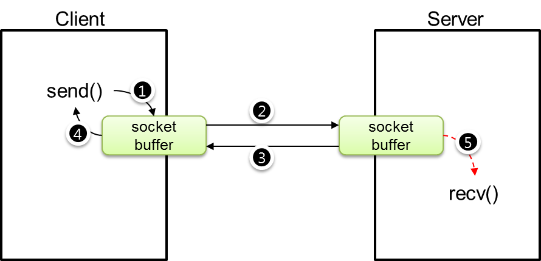

# 소켓의 blocking-mode

MongoDB의 클라이언트는 기본적으로 mongod와 통신을 수행하며, __blocking-mode__ 소켓을 사용한다. 즉, MongoDB의 클라이언트와 서버는 하나의 연결 당 한 개의 blocking-mode 소켓을 만든다. 만약 사용자가 MongoDB에 데이터를 삽입하기 위해 데이터를 호출하면, 서버와 연결된 소켓으로 데이터를 전송한다. 전송하는 방법은 send() 명령으로 수행한다. 소켓 send() 명령은 blocking-mode에서 다음과 같은 특징이 있다.

>When the message does not fit into the send buffer of the socket, send normally blocks, unless the socket has been placed in non-blocking I/O mode.

상기와 같이 send() 함수에서 리턴 값이 0보다 크다면, 이는 서버로 데이터가 전송되었음을 의미한다. [그림 1-4]을 살펴보자.

소켓 blocking-mode에서의 소켓 버퍼를 통한 데이터 전송의 흐름을 보여준다. 클라이언트에서 소켓으로 데이터를 보낸다면(send 수행), 소켓은 소켓 버퍼에 데이터를 삽입하고(1번) 소켓 버퍼에 있는 데이터는 서버 소켓 버퍼로 데이터를 전송한다.(2번) 서버는 소켓 버퍼에 전송이 완료되었음을 클라이언트에 알리고(3번), 그리고 send() 함수의 리턴 값으로 전송된 데이터 바이트 수를 알려준다.(4번)

서버는 소켓 버퍼에 데이터가 도착했음을 이벤트로 서버에 알리게 되고, recv() 함수를 통해 데이터를 소켓 버퍼로부터 취득한다.(5번) 1번부터 4번까지는 동기화되어 순서대로 수행되지만, 5번은 2번 과정에서 서버 소켓 버퍼에 데이터가 도착했을 때 발생되는 이벤트로 __비동기화__ 된다. __만약 서버가 심한 부하가 발생되어 recv() 함수로 늦게 처리할 수 있다는 의미__ 이다. 하지만, 클라이언트는 서버에 데이터를 분명히 전송되었음을 알 수 있다.

MongoDB의 일관성 문제는 여기서 발생된다. 즉, 5번의 과정이 비동기화 되므로, recv()에서 취득한 데이터를 저장소에 저장하였다는 것을 클라이언트가 한 번의 과정으로 모른다는 것이다. 이러한 과정은 다음 [그림 1-5]와 같이 서버에서 데이터가 저장소에 저장되었음을 알려주는 정보를 클라이언트에 다시 전달함으로써 완료된다.

[그림 1-5]는 클라이언트에서 보내준 데이터가 서버에서 처리가 완료되었음을 통보해 주는 흐름도이다. 즉 서버는 recv()에서 취득한 데이터를 저장소에 저장하고 다시 서버에서 send() 명령으로 클라이언트에게 저장이 완료되었음을 통보하여 클라이언트는 서버의 ACK 데이터를 취득하여 보내준 데이터가 문제없이 저장되었음을 인지한다.

***
[출처](http://mongodb.citsoft.net/?page_id=8)
