# 몽고디비와 장애
__본 장에서는 MognoDB의 설치 유형에 따른 장애 상황을 재현하고, 각 상황에 따른 대처 방안을 살펴본다.__ MongoDB의 설치는 크게 독립(standalone)과 샤드(shard) 서버 유형으로 구분된다.

독립(standalone) 서버는 복제를 제외한 데이터 저장소가 한 서버에 집중되는 설치 유형으로 컬렉션이 분리되지 않는 반면, 샤드(shard)는 수평 확장이 가능한 구조로 구성된 설치 유형으로 샤드 단위로 서버가 구성된다.(
본 장에서 다루는 서버 설치 방법은 모두 물리적 서버 한 대에서 모두 설치하는 방법으로 다룬다. 만약 여러 대의 서버에서 설치하여 테스트를 하고자 하는 경우는 IP를 변경하여 서로 다른 서버에 설치하면 된다.)

독립 서버의 복제 모드인 경우는 mongos가 설치되지 않기 때문에 장애에 따른 대처 사항을 프로그래머가 직접 작업한다는 부담이 있다. 하지만, 샤드 서버는 mongos가 설치되어 복제 집합의 마스터를 스스로 찾아내어 연결을 해 주기 때문에 프로그래머 입장에서 장애가 발생하였을 경우를 대비한 새로운 마스터를 찾을 필요는 없다.

## 독립 서버
MongoDB에서의 독립 서버란 분할 없이 __데이터를 한 서버에 모두 저장하는 방식__ 을 말하는 것으로, 크게 단일 독립 서버와 복제 독립 서버로 구성된다. 단일 독립 서버는 한 대의 서버로 구성된 것을 말하고, 복제 독립 서버는 두 대 이상으로 구성된 복제가 가능한 서버를 말한다.

### 단일 독립 서버
한 대의 서버에 한 개의 mongoDB만을 설치하는 단일 독립 서버는 한 개의 mongod를 설치한다. 설치된 한개의 mongod가 장애가 발생하면, 장애가 발생한 mongod를 다시 기동하기 전까지 복구가 불가능하다. 따라서, 단일 독립 서버에 대한 장애에 대해서는 다루지 않는다.

### 복제 독립 서버
복제 기반의 독립 서버의 설치는 적어도 3개의 mongod가 설치되어야 한다. 하지만, MongoDB는 3개의 mongod를 완전하게 사용하도록 추천하고 있지만, 단순히 복제만을 수행하기를 원하는 사람들을 위해, arbiter 개념을 두고 있다. __Arbiter는 mongod로써의 데이터 저장 기능을 가지지 않지만, 마스터 서버 장애 시에 마스터 서버 선출을 위한 투표권을 행사할 수 있는 서버이다.__ 따라서, 마스터 서버의 장애 발생 이외에는 arbiter는 DB서버로의 행위를 수행하지 않는다.

복제 기반의 독립 서버의 장애 처리를 위해 [그림 5-1]과 같은 구조로 시스템을 구축한다. 3개의 mongod를 설치하고, master 서버로 첫 번째 서버(포트 10001)으로 설정한 구성도이다. 이를 위해 다음과 같은 순서로 설치를 수행한다.

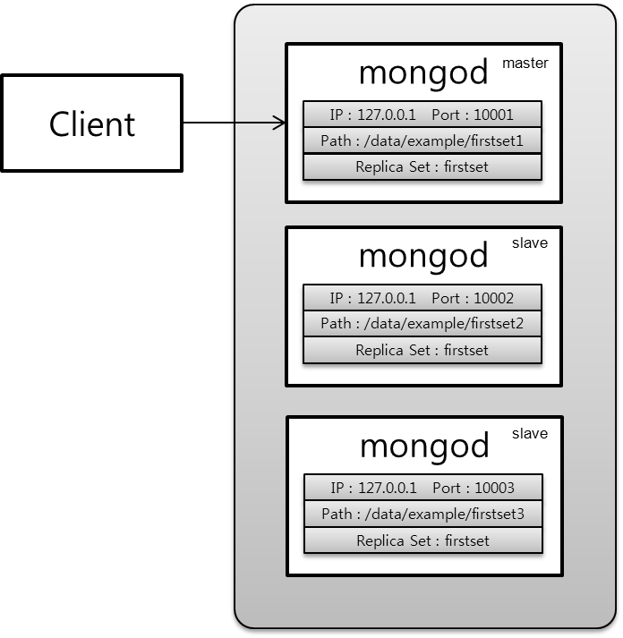

```
./mongod --dbpath /data/example/firstset1 --port 10001 --replSet firstset
./mongod --dbpath /data/example/firstset2 --port 10002 --replSet firstset
./mongod --dbpath /data/example/firstset3 --port 10003 --replSet firstset
```
3대의 mongod를 수행하고 난 다음에 MongoDB 클라이언트인 mongo를 다음과 같이 기동한다.
```
./mongo localhost:10001/admin
```
그러면 [그림 5-1]과 같이 클라이언트가 mongod 포트 10001번에 접속한 상태가 된다. 여기서 `runCommand`를 이용하여 다음과 같이 수행한다.
```
> db.runCommand({"replSetInitiate" : {"_id" : "firstset", "members" : [{"_id" : 1, "host" : "localhost:10001"}, {"_id" : 2, "host" : "localhost:10002"}, {"_id" : 3, "host" : "localhost:10003"}]}})
{
    "info" : "Config now saved locally.  Should come online in about a minute.",
    "ok" : 1
}
```
[그림 5-1]과 같이 설정된 복제 독립 서버는 클라이언트와 포트 10001번 MongoDB와 통신하며, 데이터를 적재한다. 포트 10001번 MongoDB에 적재된 데이터는 복제 정책에 의해 포트 10002, 10003번 MongoDB에 복제 저장된다.

복제 독립 서버의 장애는 마스터 서버 장애와 슬레이브 서버 장애로 구분된다. 다음의 규칙을 잘 이해하자.

1. 슬레이브 서버의 장애는 마스터 서버에 영향을 주지 않으며, 마스터 선출을 위한 투표를 수행하지 않는다.
1. 같은 복제 집합을 구성하는 서버들 중에서 마스터가 살아 있으면, 슬레이브 서버 장애 유무와 관계 없이 복제 집합은 유지된다. 다만, 살아있는 투표권이 과반수를 넘지 않은 상태의 마스터는 마스터 지위를 일정시간이 지난 이후에 포기한다.
1. 마스터 서버의 장애가 발생하면 슬레이브 서버들이 마스터 선출을 위한 투표를 진행한다.
1. 마스터 서버의 투표를 위해서는 적어도 2개의 서버가 존재하여야 한다. 따라서, 한 개의 슬레이브는 마스터로 선출될 수 없다.

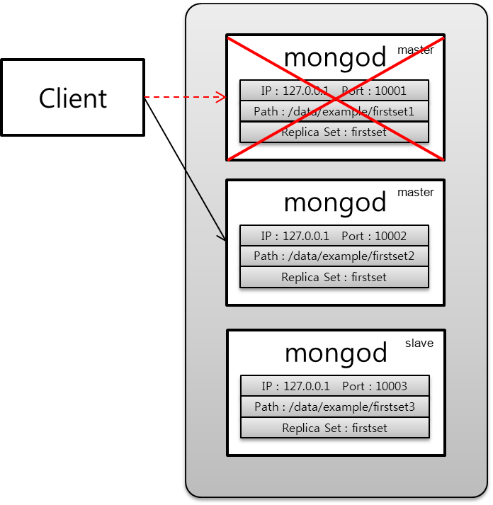

[그림 5-2]의 경우는 규칙 3, 4에 의해 슬레이브 서버가 2개 이상이므로 투표가 투표를 시작한다. 시작된 투표는 투표 알고리즘에 의해 두 개의 서버 중 한 개가 마스터로 선출된다. [그림 5-2]는 포트 10002번 서버가 마스터로 선출된 경우를 보여준다. 여기서 __중요한 점은 포트 10001번으로 연결된 클라이언트는 마스터 장애로 인해 포트 10001번과의 연결이 단절된다. 따라서, 클라이언트는 스스로 마스터를 찾아 새롭게 선출된 마스터로 연결을 시도하여야 한다.__ MongoDB의 복제 정책은 Active-Active 방식이 아니다. 따라서, 슬레이브 서버는 read-only만 가능하기 때문에, 데이터를 저장하지 않는다. 즉, 복제 독립 서버의 구성은 마스터 서버의 back-up으로 사용되는 Master-Slave 방식으로 사용된다.  

[그림 5-3]은 복제 독립 서버 장애 상황 중에서 슬레이브 서버만 장애가 발생된 시나리오다. 두 개의 슬레이브 서버가 장애가 발생하였지만, 마스터 서버가 계속 동작하고 있어서, 투표도 발생되지 않고, 클라이언트는 복제 집합에 데이터를 계속 적재할 수 있다. 장애가 발생하여도 시스템은 안전한 상태이다.

하지만, 총 3대의 서버 중에서 2대의 슬레이브 서버가 장애가 발생한 경우이므로, 서버의 과반수가 장애가 발생했다. 이 시점에서 MongoDB는 마스터의 투표권을 조사한다. __살아있는 마스터의 투표권이 전체 3개 서버가 가지고 있던 투표권 보다 과반수를 넘으면 시스템은 안전한 상태로 판단하고, 과반수가 넘지 않으면 마스터는 스스로의 마스터 지위를 포기한다.__ 이러한 증상은 [그림 5-3]의 세 번째 상태로 전이된 후, 약 25~30초 정도면 발생하며, 이를 __마스터 포기__ 라 한다.

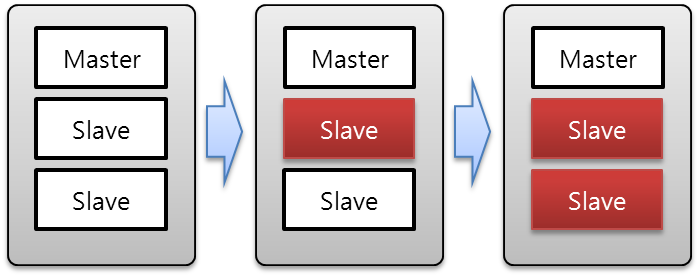

[그림 5-4]는 마스터 서버가 장애가 발생하고 슬레이브 서버들 사이에서 투표를 통해 새로운 마스터 서버를 선출하였고, 다시 슬레이브 서버에서 장애가 발생한 상태이다. [그림 5-3]과 같이 두 개의 서버가 장애가 발생했음에도 마스터가 계속 동작하고 있어서 시스템은 안전한 상태이다. 다만, [그림 5-3]과 다르게 __마스터 선출하기 위한 투표하는 동안 마스터 서버가 부재 기간이 발생하여 데이터 삽입이 발생되지 않는다.__ 또한 클라이언트 역시 새롭게 선출된 마스터로의 연결을 수행하여야 한다. [그림 5-4]도 마찬가지로 마스터의 투표권이 과반수를 넘지 않은 상태라면 25초 이후에 마스터 포기가 발생한다.

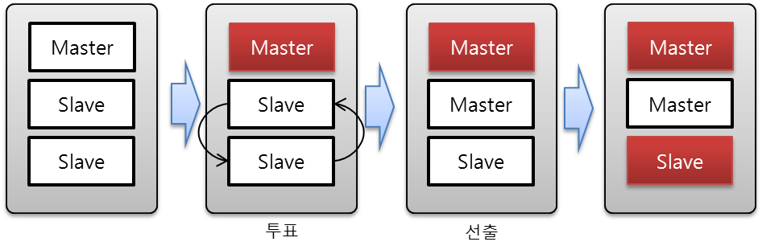

[그림 5-5]는 [그림 5-4]와 같이 초반에 마스터 서버의 장애가 발생하여 투표를 통해 새로운 마스터를 선출하였다. 하지만, 두 번째 발생한 장애 서버가 마스터인 경우는 앞에서 다룬 두 가지 경우와 같이 두 개의 서버가 장애가 발생했음에도 불구하고 마지막으로 생존해 있는 서버가 슬레이브이기 때문에 규칙 4에 의해 새로운 마스터를 선출할 수 없기 때문에, 복제 집합 전체 장애가 발생한다.

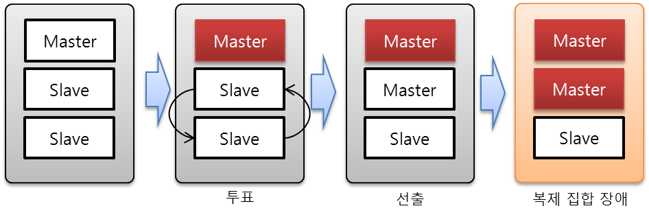

### 복제 독립 서버 복원
앞 절에서 살펴본 복제 독립 서버에서의 장애가 발생하고 장애가 발생한 서버를 재 기동할 경우에 발생되는 상황들에 대해 고찰해 본다. 장애 발생 서버의 재 기동에는 다음과 같은 규칙이 적용된다.

1. 서버를 재 기동하기 위해서는 처음 기동시킨 서버 포트와 복제 집합을 동일하게 명시하여야 한다.
1. 재 기동된 서버는 마스터로 복원되기 힘들다.

[그림 5-6]은 [그림 5-4]의 마스터 서버 장애 이후에 장애가 발생한 서버를 재 기동한 상황을 보여준다. 상기 규칙에서와 같이 다시 복원된 서버가 기존에 마스터 서버라고 하여도 기동과 동시에 마스터 서버로 설정되지 않음을 보여준다. 앞의 규칙 중 2의 경우의 재 기동된 서버인 경우에 마스터로 복원되기 어렵다는 것은 마스터로 선출될 수 있는 조건은 최신 optime이 10초이내에 있어야 마스터로 선출될 수 있는데, 서버 장애가 발생하고 10초 이내에 서버를 재 기동하지 않았다면 재 기동된 서버는 마스터로 선출되지 않는다.

```
./mongod --dbpath /data/example/firstset1 --port 10001 --replSet firstset
```

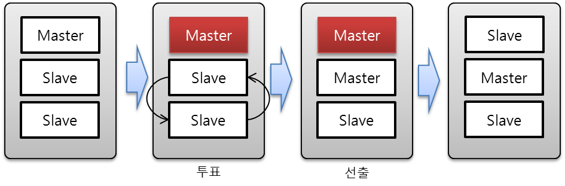

[그림 5-6]에서의 __재 기동된 서버를 다시 마스터로 설정하고 싶다면 reconfig()를 이용하여 복제 집합 서버의 priority를 조정한다.__ Priority를 별도 조정하지 않았다면, 모두 1.0의 값을 가지며, 이는 마스터 선출을 위한 투표권에 영향을 준다.
명령어 `reconfig()`는 마스터 서버에서만 사용된다. 따라서, 마스터를 변경하고 싶다면, 현 마스터 서버에서 새로운 마스터 서버의 priority를 조정한다. 앞선 복제 독립 서버와 포트 10001, 10002, 10003을 기동하였다고 가정한다. 그리고, 마스터 서버 포트 10001번을 죽이고, 새로운 마스터 서버 포트 10002가 선출되었다. 새로운 마스터와 서버 연결을 위해 다음과 같이 새로운 mongo 클라이언트를 기동한다.

```
./mongo localhost:10002
> cfg = rs.config()
> cfg.member[0].priority = 2
> rs.reconfig(cfg)
```
상기와 같이 명령어를 수행한 결과는 아래와 같다. 첫 번째 명령어 `rs.config()`를 수행하면 현재 복제 집합의 설정 상태를 보여준다. 그리고, 원하는 서버 포트 10001의 priority를 2로 설정하고 난 뒤에 `rs.reconfig(cfg)`를 수행한다. 하기와 같이 접속한 서버 포트 10002는 마스터의 위치에서 슬레이브로 변경된 것을 알 수 있다.

[리스트 5-1] 복제 독립 서버에서의 마스터 서버 변경
```
PRIMARY> cfg = rs.conf()
{
    "_id" : "firstset",
    "version" : 1,
    "members" : [
        {
            "_id" : 1,
            "host" : "localhost:10001"
        },
        {
            "_id" : 2,
            "host" : "localhost:10002"
        },
        {
            "_id" : 3,
            "host" : "localhost:10003"
        }
    ]
}
PRIMARY> cfg.members[0].priority = 2
2
PRIMARY> rs.reconfig(cfg)
Wed Jun  6 19:49:22 DBClientCursor::init call() failed
Wed Jun  6 19:49:22 query failed : admin.$cmd { replSetReconfig: { _id: "firstset", version: 2, members: [ { _id: 1, host: "localhost:10001", priority: 2.0 }, { _id: 2, host: "localhost:10002" }, { _id: 3, host: "localhost:10003" } ] } } to: localhost:10002
Wed Jun  6 19:49:22 trying reconnect to localhost:10002
Wed Jun  6 19:49:22 reconnect localhost:10002 ok
reconnected to server after rs command (which is normal)

PRIMARY>
Wed Jun  6 19:49:49 Socket recv() errno:104 Connection reset by peer 127.0.0.1:10002
Wed Jun  6 19:49:49 SocketException: remote: 127.0.0.1:10002 error: 9001 socket exception [1] server [127.0.0.1:10002]
Wed Jun  6 19:49:49 DBClientCursor::init call() failed
>
Wed Jun  6 19:49:50 trying reconnect to localhost:10002
Wed Jun  6 19:49:50 reconnect localhost:10002 ok
SECONDARY>
SECONDARY>
SECONDARY>
```

복원 서버 규칙 2번이 성립되지 않는 경우를 고려해 보자. 이러한 경우는 [그림 5-7]과 같이 Master가 장애가 발생하여 새로운 마스터가 선출된 다음, 바로 장애가 발생한 서버가 복구되어 투표를 통해 다시 마스터로 선출되는 경우이다. 장애가 발생한 마스터가 다시 마스터로 선출되는 경우는 마스터 선출 규칙에 의해 서버가 가지고 있는 최신의 optime이 10초 이내에 있는 경우이다. 따라서, 마스터 장애 이후 10초 안에 복구되어 다시 투표에서 마스터로 선출된 것이다.

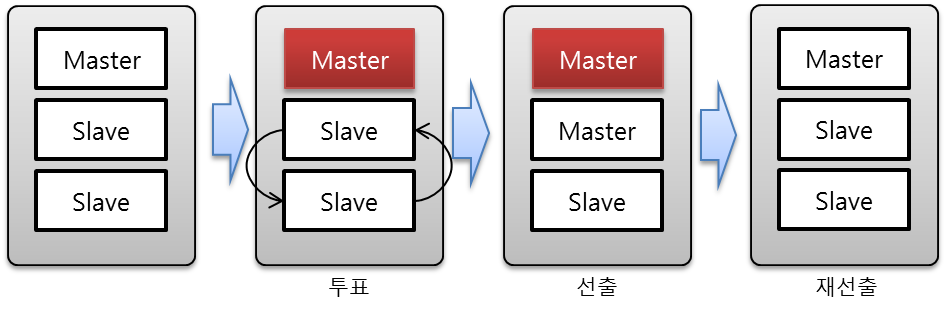

[그림 5-7]과 같이 장애 발생한 __마스터가 복구 후에 다시 마스터로 선출되는 경우에 발생하는 문제점은 [그림 5-8]과 같은 데이터 롤백(Rollback) 현상이다.__ [그림 5-8]의 좌측과 같이 슬레이브가 마스터보다 더 많은 데이터를 가지고 있음에도 불구하고, MongoDB는 마스터의 데이터를 기준으로 슬레이브의 데이터를 삭제 처리한다. 이와 같은 현상은 접속 량이 폭주하여 동시에 수많은 데이터를 저장하는 연산이 지속적으로 발생되는 상태에서, 마스터 서버의 장애가 발생하고 슬레이브 중 하나가 마스터로 전환된 다음에 데이터를 입력 받아 저장한다. 그리고 10초 안에 장애가 발생한 이전 마스터가 복구되어 투표를 통해 다시 마스터 권한을 획득하였다면, [그림 5-8]과 같은 현상이 나타난다.

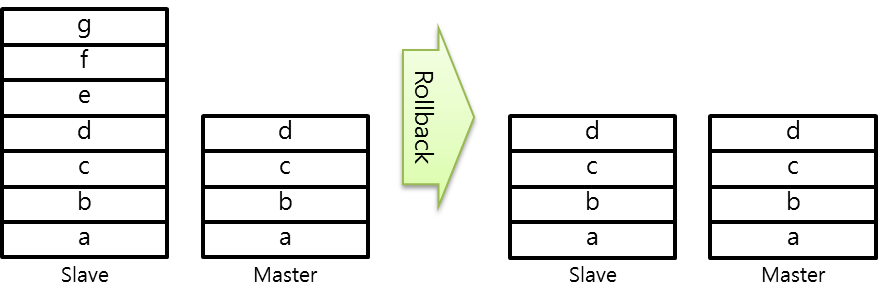

### 복제 독립 서버와 아비터
앞 절에서 살펴본 복제 서버는 모두 완전 mongod 서버를 대상으로 설명하였다. 아비타 서버는 저장 능력이 없는 서버이기는 하지만, 마스터 장애가 발생할 경우에 마스터 선출을 위한 투표를 수행한다. 다만, 아비타 서버는 마스터가 될 수 없기 때문에, priority는 0을  가진다.

아비타 서버의 기동은 일반 mongod 서버 기동과 동일하다. 다만, 관리자가 해당 서버를 아비타로 동작시킬 계획이라면, 초기 mongod가 기동과 동시에 로컬 디스크의 약 5% 정도를 미리 확보하는 동작을 최소화시키는 것이 좋다. 이를 위해 포트 10003 서버를 아비타로 동작시킬 경우는 다음과 같이 수행한다.

```
./mongod --dbpath /data/example/firstset3 --port 10003 --replSet firstset –oplogSize 1
```

## 샤드 서버
샤드(shard) 서버는 데이터 분할을 시킬 수 있는 서버 구조로 모든 분산데이터베이스의 기본 기능인 샤딩(sharding)을 수행한다. 앞 절의 __복제 독립 서버의 단점은 클라이언트가 접속한 마스터 서버가 장애가 발생한다면, 클라이언트는 새로운 마스터 서버를 선출된 다음에 새로운 마스터 서버에 대한 정보를 자동으로 알아낼 수 있는 방법이 없다는 것이다.__

이러한 문제점은 클라이언트는 복제 독립 서버일 경우에는 복제 집합에 있는 모든 서버의 상태를 수시로 점검하고 마스터 인지 아닌지를 판독하는 프로세스가 동작하고 있어야 한다. 이러한 모든 수고를 샤드 서버 구조에서는 mongos가 대신해 준다. Mongos는 MongoDB의 샤드 서버 구조에 새롭게 추가된 서버로 다음과 같은 주요 업무를 수행한다.

+ 복제 집합의 마스터 서버와의 연결
+ 샤딩 정책 수행

첫 번째 역할은 MongoDB를 사용하는 클라이언트는 복제 집합의 마스터가 누구인지 알지 않아도 mongos를 통해 알아서 데이터를 적재할 수 있다는 것이다. 즉, 임의의 복제 집합에서 마스터가 존재하는 이상, 사용자는 데이터를 적재할 수 있다. 두 번째 역할은 복제 집합 사이의 데이터 분할을 결정하는 것으로, __일정 크기의 데이터 크기가 적재되면 이를 두 조각으로 분리한 후, 새로운 복제 집합으로 데이터를 이동시키는 기능을 수행한다.__

위에서 살펴본 mongos가 존재하기 때문에, MongoDB 사용자는 장애에 대한 예외 처리가 상당히 수월해 졌으며, 임의의 복제 집합 안의 마스터가 사라지지 않는 이상 장애에 대한 관리자 처리가 서비스 중단 없이 이루어 질 수 있다.

### 단일 샤드 서버 구성
샤드 서버에서의 장애 처리를 위해 우선 3개 서버로 구성된 한 개의 복제 집합이 한 개의 샤드로 구성된 샤드 서버 구조로 설치한다. Config 서버 3대, mongod 서버 3대, 그리고 mongos 서버 1대로 구성된 총 7개의 프로세스로 [그림 5-9]와 같이 구성한다.

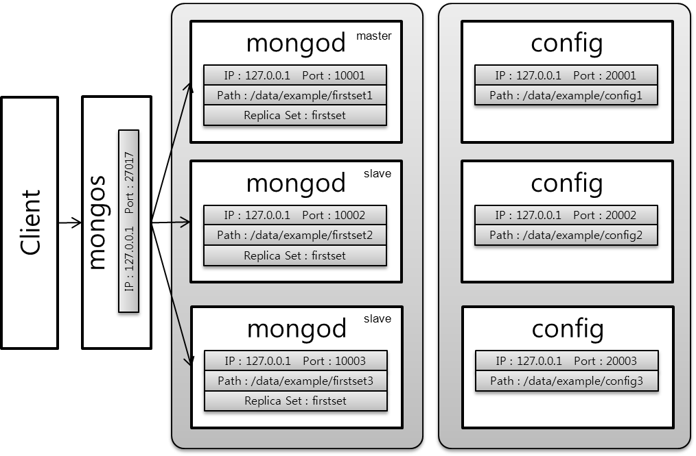

#### 복제 집합(replica set) 설치
[그림 5-9]과 같은 시스템을 구축하기 위해서 복제 독립 서버 구조로 다음과 같이 설정한다.
```
./mongod --dbpath /data/example/firstset1 --port 10001 --replSet firstset
./mongod --dbpath /data/example/firstset2 --port 10002 --replSet firstset
./mongod --dbpath /data/example/firstset3 --port 10003 --replSet firstset
```
3대의 mongod가 기동되었다면, 포트 10001 서버를 마스터로 만들기 위해 다음과 같은 수순으로 설정한다.
```
./mongo localhost:10001/admin
```
```
> db.runCommand({"replSetInitiate" : {"_id" : "firstset", "members" : [{"_id" : 1, "host" : "localhost:10001"}, {"_id" : 2, "host" : "localhost:10002"}, {"_id" : 3, "host" : "localhost:10003"}]}})
{
 "info" : "Config now saved locally. Should come online in about a minute.",
 "ok" : 1
}
```
#### Config 집합 설치

샤드 서버를 구성하기 위해서는 총 3대의 config 서버가 동작되어야 한다. Config 서버 역시 데이터 파일을 생성하기 때문에 dbpath가 설정되어야 한다. 따라서, 3대의 config 서버가 사용할 폴더 경로를 다음과 같이 설정한다.
```
/data/example/config1
/data/example/config2
/data/example/config3
```
```
./mongod –configsvr --dbpath /data/example/config1 --port 20001
./mongod –configsvr --dbpath /data/example/config2 --port 20002
./mongod –configsvr --dbpath /data/example/config3 --port 20003
```

#### 라우터 설치 그리고 Config 서버와 연결하기
Config 서버 설치가 모두 완료되었다면, 다음과 같이 mongos를 기동시킨다. Mongos는 mongod와 config 서버와는 달리 dbpath를 가지지 않는다. 즉, 모든 정보는 메모리에 보관하고 있기 때문에 로컬 폴더 경로를 설정하지 않는다. Mongos의 기능 중 하나가 샤딩 정책을 수행하는 것으로 샤딩을 위한 청크(chunk) 크기를 설정하는 `chunkSize` 옵션을 사용한다. 본 보고서에서는 테스트를 위해 1이라는 값을 사용한다. 1은 1MByte를 의미하는 것으로, 1Mbytes의 데이터의 크기에 도달하면 샤딩을 수행한다는 의미이다. 디폴트 크기는 64Mbytes이다.

```
./mongos --configdb localhost:20001,localhost:20002,localhost:20003 --port 27017 --chunkSize 1
```

#### 라우터 접속하기
[그림 5-9]를 보면 클라이언트가 mongos로 연결된다. 복제 독립 서버에서는 클라이언트가 mongod에 바로 접속하였지만, 샤드 서버 구조에서는 클라이언트는 mongos에 접속한다. 이점을 주의하자. Mongos의 접속 방법은 다음과 같다.
```
./mongo localhost:27017/admin
```
앞에서 mongos를 포트 27017로 설정하였으므로, mongo 클라이언트를 포트 27017로 접속한다. 접속을 완료하면, mongos는 config 서버와 연결된 상태로, 아직 데이터 저장 서버인 샤드와의 접속은 없는 상태이다.

#### 라우더 - 샤드 연결
Mongos와의 연결을 완료하였다면, 샤드를 등록한다. 샤드는 3개로 구성된 복제 독립 서버를 등록한다. 등록하는 방법은 다음과 같다.
```
mongos> db.runCommand( { addshard : "firstset/localhost:10001,localhost:10002,localhost:10003" } )
{ "shardAdded" : "firstset", "ok" : 1 }
mongos>
```

#### 데이터 삽입 테스트
샤드가 정확하게 설치 되었는지 확인하기 위해 다음과 같이 수행한다.
```
mongos > use test
switched to db test
mongos > people = ["Marc", "Bill", "George", "Eliot", "Matt", "Trey", "Tracy", "Greg", "Steve", "Kristina", "Katie", "Jeff"];
mongos > for(var i=0; i<1000000; i++){
     name = people[Math.floor(Math.random()*people.length)];
     user_id = i;
     boolean = [true, false][Math.floor(Math.random()*2)];
     added_at = new Date();
     number = Math.floor(Math.random()*10001);
     db.test_collection.save({"name":name, "user_id":user_id, "boolean": boolean, "added_at":added_at, "number":number });
}
```

상기와 같이 데이터를 삽입하고 난 다음에 `db.stats()`를 수행하면 연결 데이터베이스의 상태를 다음과 같이 보여준다.


[리스트 5-2] 샤드 서버 구성 및 데이터 삽입 이후 DB 상태
```
mongos> db.stats()
{
    "raw" : {
        "firstset/localhost:10001,localhost:10002,localhost:10003" : {
            "db" : "test",
            "collections" : 3,
            "objects" : 1000004,
            "avgObjSize" : 100.33422666309335,
            "dataSize" : 100334628,
            "storageSize" : 141258752,
            "numExtents" : 15,
            "indexes" : 1,
            "indexSize" : 32458720,
            "fileSize" : 469762048,
            "nsSizeMB" : 16,
            "ok" : 1
        }
    },
    "objects" : 1000004,
    "avgObjSize" : 100.33422666309335,
    "dataSize" : 100334628,
    "storageSize" : 141258752,
    "numExtents" : 15,
    "indexes" : 1,
    "indexSize" : 32458720,
    "fileSize" : 469762048,
    "ok" : 1
}
mongos>
```

### Config 서버 장애
[그림 5-9]에서 config 서버가 장애가 발생한 후 데이터 삽입이 발생하였을 경우를 살펴보자. MongoDB의 `config 서버는 데이터 삽입에 영향을 주지 않고, 샤딩 정책을 위한 메타 데이터를 저장하고 있기 때문에 샤딩에 영향을 준다.` 따라서, `config 서버가 죽더라도 데이터 삽입에 영향을 주어서는 안된다.` [리스트 5-3]은 포트 20001 config 서버를 강제로 종료하여 config 서버를 read-only로 만든 후에 데이터를 삽입한 결과를 보여준다.

데이터 삽입은 다음과 같다.
```
mongos> for(var i=0; i<1000000; i++){
     name = people[Math.floor(Math.random()*people.length)];
     user_id = i;
     boolean = [true, false][Math.floor(Math.random()*2)];
     added_at = new Date();
     number = Math.floor(Math.random()*10001);
     db.test_collection.save({"name":name, "user_id":user_id, "boolean": boolean,
                   "added_at":added_at, "number":number });
}
```

[리스트 5-3] 포트 20001 config 서버 장애 이후 데이터 삽입
```
mongos> db.stats()
{
    "raw" : {
        "firstset/localhost:10001,localhost:10002,localhost:10003" : {
            "db" : "test",
            "collections" : 3,
            "objects" : 2000004,
            "avgObjSize" : 100.33407533184933,
            "dataSize" : 200668552,
            "storageSize" : 272633856,
            "numExtents" : 18,
            "indexes" : 1,
            "indexSize" : 64909264,
            "fileSize" : 1006632960,
            "nsSizeMB" : 16,
            "ok" : 1
        }
    },
    "objects" : 2000004,
    "avgObjSize" : 100.33407533184933,
    "dataSize" : 200668552,
    "storageSize" : 272633856,
    "numExtents" : 18,
    "indexes" : 1,
    "indexSize" : 64909264,
    "fileSize" : 1006632960,
    "ok" : 1
}
mongos>
```

[리스트 5-3]에서 데이터 백만건을 다시 입력한 것이라, [리스트 5-2]보다 정확하게 백만건이 더 삽입되어 있다. 두 번째 config 서버 장애 상황을 고려해 보자. 전자의 경우는 config 서버가 장애가 발생하고 난 다음에 백만건의 데이터를 삽입한 경우이고, 이번에 테스트할 사항은 백만건을 삽입하는 도중에 config 서버가 장애가 발생하는 경우이다.

테스트를 위해 앞에서 강제 종료한 포트 20001 config 서버를 다시 재기동한다.
```
./mongod –configsvr --dbpath /data/example/config1 --port 20001
```

데이터를 백만건 삽입을 수행한 후에 포트 20001 config 서버를 강제 종료시킨다. 이와 같을 경우, config 서버가 데이터 삽입에 영향을 주지 않기 때문에 [리스트 5-4]와 같이 정확하게 3백만건이 삽입되어 있는 것을 볼 수 있다.

[리스트 5-4] 데이터 삽입 도중 config 서버 장애 발생
```
mongos> db.stats()
{
    "raw" : {
        "firstset/localhost:10001,localhost:10002,localhost:10003" : {
            "db" : "test",
            "collections" : 3,
            "objects" : 3000004,
            "avgObjSize" : 100.3336955550726,
            "dataSize" : 301001488,
            "storageSize" : 409849856,
            "numExtents" : 20,
            "indexes" : 1,
            "indexSize" : 97343456,
            "fileSize" : 2080374784,
            "nsSizeMB" : 16,
            "ok" : 1
        }
    },
    "objects" : 3000004,
    "avgObjSize" : 100.3336955550726,
    "dataSize" : 301001488,
    "storageSize" : 409849856,
    "numExtents" : 20,
    "indexes" : 1,
    "indexSize" : 97343456,
    "fileSize" : 2080374784,
    "ok" : 1
}
mongos>
```


마지막 세 번째 경우로 config 서버 3대를 모두 장애를 발생시킨 후 데이터 삽입을 수행한 경우를 살펴보자. 이를 위해 포트 20001, 20002, 20003 config 서버 3대를 Ctrl+C 키를 입력하여 강제 종료시킨다. 그러면 mongos는 한 개의 config 서버와도 연결되어 있지 않게 된다. 이 상태에서 동일한 백만건 데이터를 삽입하는 스크립트를 기동하고 난 다음에 DB 상태를 살펴본 결과는 [리스트 5-5]와 같다.

[리스트 5-5] config 서버 집합 3대 모두 장애 발생 후 데이터 삽입
```
mongos> db.stats()
{
    "raw" : {
        "firstset/localhost:10001,localhost:10002,localhost:10003" : {
            "db" : "test",
            "collections" : 3,
            "objects" : 4000004,
            "avgObjSize" : 100.33407666592333,
            "dataSize" : 401336708,
            "storageSize" : 499666944,
            "numExtents" : 21,
            "indexes" : 1,
            "indexSize" : 129794000,
            "fileSize" : 2080374784,
            "nsSizeMB" : 16,
            "ok" : 1
        }
    },
    "objects" : 4000004,
    "avgObjSize" : 100.33407666592333,
    "dataSize" : 401336708,
    "storageSize" : 499666944,
    "numExtents" : 21,
    "indexes" : 1,
    "indexSize" : 129794000,
    "fileSize" : 2080374784,
    "ok" : 1
}
mongos>
```

[리스트 5-5]를 살펴보면 정확하게 백만건 데이터가 삽입된 것을 볼 수 있다. 따라서, 앞에서 살펴본 config 서버는 데이터 삽입에 영향을 주지 않는 것을 알 수 있다.
Config 서버는 다시 기동시키면 mongos와 연결되어 복원된다. 3개의 config 서버가 모두 종료된 후에 다음과 같이 3개의 config 서버를 모두 재기동시킨다. 재기동된 서버는 mongos가 살아 있는 이상 config 서버가 자신의 상태 정보를 저장한 로컬에서 읽어 들여 상태를 복원한다. 그리고, mongos는 주기적으로 config 서버의 상태를 체크하기 때문에 복원된 서버와의 접속을 수행해 상태를 정상적인 상태로 유지시키게 된다.

### 마스터 서버 장애
앞절에서 우리는 config 서버가 데이터 삽입과는 연관이 없는 것을 살펴보았다. 그러면 샤드를 구성하고 있는 __복제 집합 서버인 mongod가 장애가 발생하였다면 어떠한 문제가 있는지 살펴보자.__ [그림 5-10]과 같이 mongos가 우선은 포트 10001 마스터 서버에 데이터를 삽입하고 있는 상태이다. 그리고, 포트 10001 서버가 장애가 발생하여 새로운 마스터 서버를 선출하게 된다. 새로운 마스터 서버는 포트 10003 서버가 선출되었다. Mongos를 통해 새롭게 백만건 데이터를 삽입할 경우에 정확하게 데이터가 삽입되었는지 알아보면 [리스트 5-6]과 같이 정확하게 백만건이 삽입되어 있는 것을 알 수 있다.

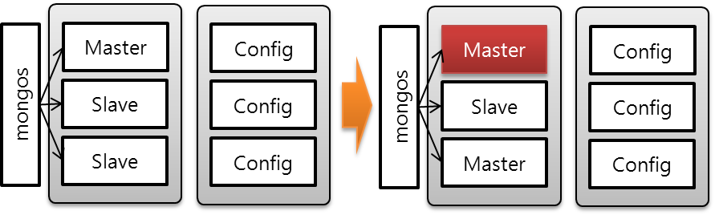

[리스트 5-6] 단일 샤드 서버에서 마스터 장애 이후 데이터 삽입
```
mongos> db.stats()
{
    "raw" : {
        "firstset/localhost:10001,localhost:10002,localhost:10003" : {
            "db" : "test",
            "collections" : 3,
            "objects" : 5000004,
            "avgObjSize" : 100.33406133275093,
            "dataSize" : 501670708,
            "storageSize" : 607449088,
            "numExtents" : 22,
            "indexes" : 1,
            "indexSize" : 162228192,
            "fileSize" : 2080374784,
            "nsSizeMB" : 16,
            "ok" : 1
        }
    },
    "objects" : 5000004,
    "avgObjSize" : 100.33406133275093,
    "dataSize" : 501670708,
    "storageSize" : 607449088,
    "numExtents" : 22,
    "indexes" : 1,
    "indexSize" : 162228192,
    "fileSize" : 2080374784,
    "ok" : 1
}
mongos>
```

[그림 5-10]의 상황에서 새롭게 선출된 마스터 서버 포트 10003 서버가 다시 장애가 발생되어 복제 집합에서 마스터 서버를 선출할 수 없는 상황이 발생되었다. 즉, __마스터 서버가 존재하지 않기 때문에 해당 샤드 서버는 데이터 삽입을 수행할 수 없게 된다.__ 하지만, mongos는 살아있기 때문에 클라이언트는 MongoDB와의 접속이 유지되어 있다. 이와 같을 경우 [리스트 5-7]과 같이 데이터 삽입을 수행하면 `Socket exception` 이라는 에러가 발생한다.

[리스트 5-7] 샤드 서버에서 마스터 서버가 모두 장애가 발생한 경우
```
mongos> for(var i=0; i<10; i++){
... name = people[Math.floor(Math.random()*people.length)];
...      user_id = i;
...      boolean = [true, false][Math.floor(Math.random()*2)];
...      added_at = new Date();
...      number = Math.floor(Math.random()*10001);
... r_id":user_id, "boolean": boolean, "added_at":added_at, "number":number });
... }
socket exception
```

[그림 5-12]는 [그림 5-11]의 상태에서 서버를 재기동한 모습이다. 장애가 발생한 서버를 재기동하면, 마지막으로 마스터가 설정된 서버가 다시 마스터가 된다. __Mongos는 마스터 서버가 다시 복원된 것을 판단하고, 데이터 삽입을 마스터 서버로 보내게 된다.__ [리스트 5-8]은 [그림 5-12]로 서버가 복원된 다음에 데이터를 백만건 삽입한 경우에, 결과를 출력한 것이다. 정상적으로 데이터가 백만건이 삽입되었음을 알 수 있다.

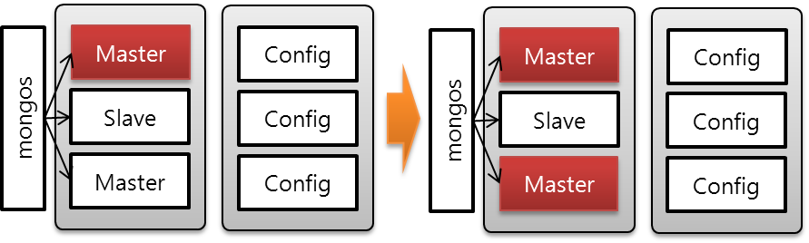

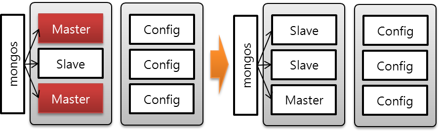

[리스트 5-8] 마스터 서버 복구 후 데이터 백만건 삽입
```
mongos> db.stats()
{
    "raw" : {
        "firstset/localhost:10001,localhost:10002,localhost:10003" : {
            "db" : "test",
            "collections" : 3,
            "objects" : 6000004,
            "avgObjSize" : 100.33383777744149,
            "dataSize" : 602003428,
            "storageSize" : 736788480,
            "numExtents" : 23,
            "indexes" : 1,
            "indexSize" : 194678736,
            "fileSize" : 2080374784,
            "nsSizeMB" : 16,
            "ok" : 1
        }
    },
    "objects" : 6000004,
    "avgObjSize" : 100.33383777744149,
    "dataSize" : 602003428,
    "storageSize" : 736788480,
    "numExtents" : 23,
    "indexes" : 1,
    "indexSize" : 194678736,
    "fileSize" : 2080374784,
    "ok" : 1
}
mongos>
```

가장 중요한 테스트로 데이터가 삽입하는 상황에서 __마스터 서버에 장애가 발생하여 새로운 마스터를 선출하는 과정이 발생하였다면, 데이터 삽입이 정확하게 이루어지는지 확인해 보아야 한다.__ [그림 5-13]은 마스터 서버 포트 10003 서버를 데이터 삽입하는 도중에 장애를 발생시킨 상황을 보여준다. 이와 같을 경우에 데이터 삽입이 완료한 후 삽입된 데이터의 개수를 살펴본 결과를 [리스트 5-9]에서 보여준다. 데이터는 십만개를 삽입하였다.

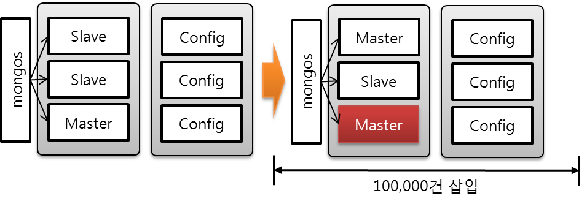

[리스트 5-9]에서 데이터 100,000건 중에 2,889건에 대해서 오류가 발생하였다. 이는 마스터 선출을 위해 투표하는 도중에 삽입된 데이터를 MongoDB가 오류로 처리한 것이다. 이와 같은 경우는 `getLastError()`를 이용하여 데이터 재 삽입을 수행하여야 한다.

[리스트 5-9] 데이터 삽입 중에 마스터 서버가 장애가 발생한 상태
```
mongos> db.stats()
{
    "raw" : {
        "firstset/localhost:10001,localhost:10002,localhost:10003" : {
            "db" : "test",
            "collections" : 3,
            "objects" : 6000004,
            "avgObjSize" : 100.33383777744149,
            "dataSize" : 602003428,
            "storageSize" : 736788480,
            "numExtents" : 23,
            "indexes" : 1,
            "indexSize" : 194678736,
            "fileSize" : 2080374784,
            "nsSizeMB" : 16,
            "ok" : 1
        }
    },
    "objects" : 6000004,
    "avgObjSize" : 100.33383777744149,
    "dataSize" : 602003428,
    "storageSize" : 736788480,
    "numExtents" : 23,
    "indexes" : 1,
    "indexSize" : 194678736,
    "fileSize" : 2080374784,
    "ok" : 1
}
mongos>
```
