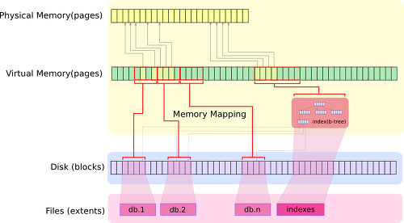

# 몽고디비의 메모리 IO 구조
## 서론
MongoDB를 구성할때 보면, 가장 많이 권장 받는 부분 중의 하나가, 메모리량과 디스크 성능이다.  
메모리 크기가 아주 sensitive한 요인이 되는데, 어떤 부분이 문제가 되는지 내부 저장 구조를 살펴 봄으로써 이해를 돕고자 한다.

## 저장 구조
mongodb는 기본적으로 memory mapped file (OS에서 제공되는 mmap을 사용) 을 사용한다. mongodb는 데이타를 write할때, __논리적으로 memory 공간에 write하고, 일정 주기에 따라서, 이 메모리 block들을 주기적으로 disk로 write__ 하는데, 이 디스크 writing 작업은 OS에 의해서 이루어 진다.  
OS에 의해서 제공되는 Virtual Memory를 사용하게 되는데, __Pysical Memory 양이 작더라도 Virtual Memory는 훨씬 큰 공간을 가질 수 있다.__ Virtual Memory는 page라는 블럭 단위로 나뉘어 지고, 이 Block들은 Disk의 block에 mapping이되고, 이 block들의 집합이 하나의 데이타 파일이 된다. (아래 그림 참조)

## 메모리에 저장되는 내용
메모리에 저장되는 내용은 실제 데이타 블록과, Index 자체가 저장이 된다. mongodb에서 index를 남용하지 말라는 이야기가 있는데, 이는 index를 생성 및 업데이트 하는 데 자원이 들어갈뿐더러, __index가 메모리에 상주하고 있어야 제대로 된 성능을 낼 수 있기 때문__ 이기도 하다.  

만약에 Physical Memory에 해당 데이타 블록이 없다면, page fault가 발생하게 되고, disk에서 그 데이타 블록을 loading하게 된다. 물론 그 데이타 블록을 loading하기 위해서는 다른 데이타 블록을 disk에 써야 한다.  
즉, page fault가 발생하면, page를 __memory와 disk 사이에 switching하는 현상이 일어나기 때문에, disk io가 발생하고, 성능 저하를 유발하게 된다.__  

즉 메모리 용량을 최대한 크게 해서 이 page fault를 예방하라는 이야기이다.  
그러나, page fault가 안 발생할 수 는 없고, (1TB 저장하려고, 메모리를 진짜 1TB를 저장할 수 없는 노릇이니...). page fault를 줄이는 전략으로 접근 하는 것이 옳은 방법인데..  

page fault시 disk로 write되는 데이타는 LRU 로직에 의해서 결정이 된다. 그래서, 자주 안쓰는 데이타가 disk로 out되는데, 일반적인 application에서 자주 쓰는 데이타 (최근 데이타)의 비율은 그리 크지 않다. 예를 들어 게시판이나 블로그만을 생각해보더라도, 앞의 1~10 페이지 정도가 많이 보게 되지 뒤의 데이타를 잘 안보게 된다.  

이렇게 자주 억세스 되는 데이타를 __Hot Data__ 라고 하는데,이 Hot Data 들이 집중되서 메모리에 올라가도록 __key 설계를 하는 것이 핵심__ 이다.  
쓸떼 없이 전체 데이타를 scan하는 등의 작업을 하게 되면, 100% page fault가 발생하기 때문에, table scan등이 필요한 시나리오는 별도의 index table(summary table)을 만들어서 사용하는 등의 전략이 필요하다.

## note
>Physical memory < Virtual Memory (=Physical memory + Swapping) < mmap = total file size < disk size

>Do I need to configure swap space?¶
Always configure systems to have swap space. Without swap, your system may not be reliant in some situations with extreme memory constraints, memory leaks, or multiple programs using the same memory. Think of the swap space as something like a steam release valve that allows the system to release extra pressure without affecting the overall functioning of the system.

>Nevertheless, systems running MongoDB do not need swap for routine operation. Database files are memory-mapped and should constitute most of your MongoDB memory use. Therefore, it is unlikely that mongod will ever use any swap space in normal operation. The operating system will release memory from the memory mapped files without needing swap and MongoDB can write data to the data files without needing the swap system.

http://docs.mongodb.org/manual/faq/diagnostics/#faq-memory

***
출처: [조대협의 블로그](http://bcho.tistory.com/746)
