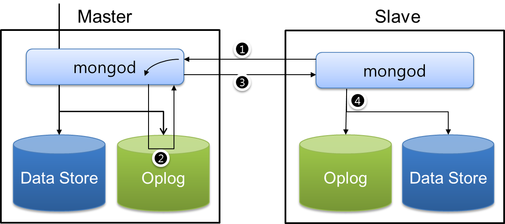
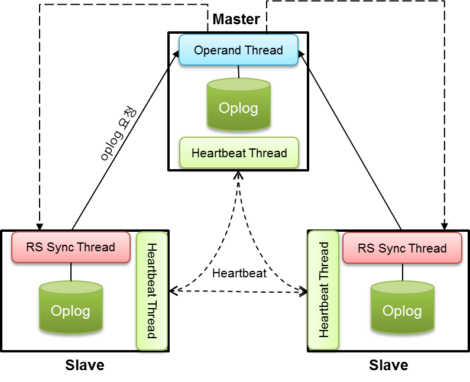
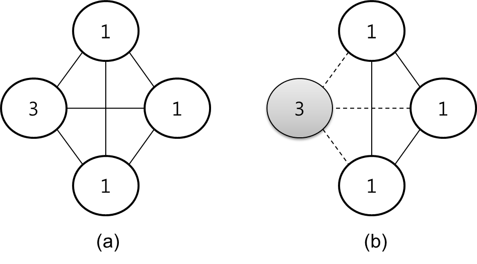
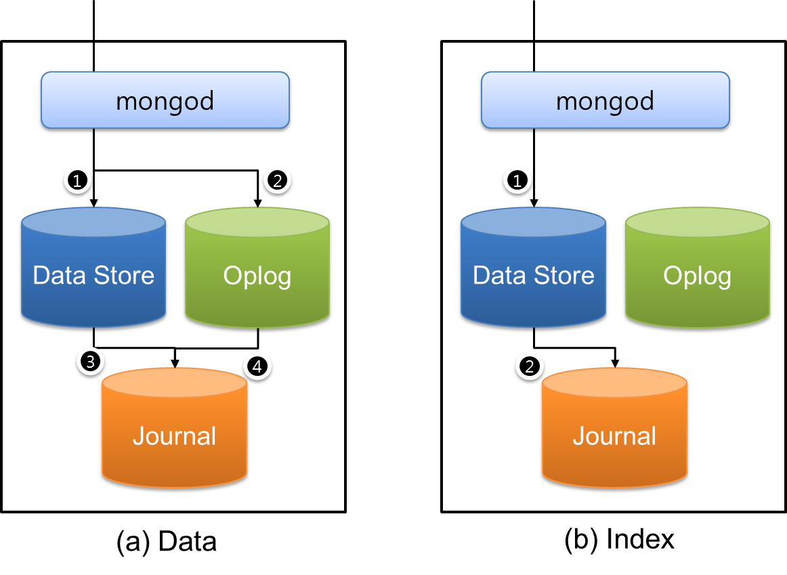

# 몽고디비의 복제
## 복제 시스템
### Master-Slave
MongoDB의 복제 정책은 기본적으로 __Master-Slave__ 방식을 채택하고 있으며, master가 죽더라도 slave들 중에서 master를 선출할 수 있는 master 선출 방법을 채택하고 있다. 즉, Master가 죽으면, slave들이 투표를 진행하고 투표된 결과에 따라 새로운 master가 선출된다.

[그림 2-1]은 MongoDB의 복제 정책을 보여준다. MongoDB의 __master는 쓰기 연산__ 을 담당한다. 즉, 일반 Master-Slave 방식과 동일하게 쓰기는 master에서만 이루어진다. 이때 MongoDB는 쓰기 연산을 데이터 저장소와 Oplog라는 두 군데 영역에 저장한다. 데이터 저장소에는 B+ 트리로 구성된 데이터 저장소를 말하는 것으로, 쓰기 연산을 수행한 결과를 저장한다. 반면 __Oplog는 데이터 저장소에 저장된 데이터와는 달리 연산 수행과 관련된 명령 자체를 타임스탬프와 같이 저장한다__.  

### oplog
MongoDB의 slave는 아주 빠른 주기적으로 master에게 자신의 optime보다 큰 oplog를 달라고 요청한다. Slave의 요청은 master에 oplog 데이터를 요청할 때, 질의 요청 옵션을 QueryOption_AwaitData으로 보낸다. QueryOption_AwaitData는 대기하는 일정 시간 안에 응답할 데이터가 존재한다면 바로 응답하고, 응답할 데이터가 없다면, 일정 시간을 대기한다는 것을 의미한다. Oplog 질의에 대한 대기 시간은 5초이다. 즉, 5초안에 master에서 쓰기 연산이 발생하면 바로 데이터를 응답해 주고, 5초안에 쓰기 연산이 발생하지 않는다면, 데이터가 존재하지 않는다는 응답을 보내준다. Slave는 요구한 Oplog의 데이터가 존재하면 자신의 Oplog에 데이터를 저장한 다음에 바로 mater에 다시 Oplog 질의를 수행한다.  

### 동기화 처리
Slave의 동기화 처리는 쓰레드 한 개가 지속적으로 담당하고 있다. 만약, master와의 연결이 단절되어 Oplog를 동기화 시키지 못하게 되는 경우는 자신의 Oplog의 마지막 연산 시간을 저장하고, Oplog를 비우고 난 다음에 메모리에 보관된 모든 데이터를 데이터 저장소에 저장시킨다. 그리고, 5초 이후에 다시 master와의 연결을 시도한다.  

Master 역시 slave와의 동기화를 위해 한 개의 쓰레드를 만들어 slave와의 통신을 담당하고 slave가 요구하는 데이터를 전달한다. 따라서 master는 능동적 동기화 보다는 수동적 동기화 입장이므로, slave들의 요구에 따라 데이터를 전송하는 부담만 지게 된다. 이러한 MongoDB의 철학은 master의 역할을 쓰기 연산에 집중 하도록 구성하여 빠른 속도를 구사할 수 있도록 만들고 있다. 실제 성능 테스트를 수행하였을 경우에도, 복제를 설정한 상태에서 master의 부하가 가중되지는 않는다. 성능 이슈는 5% 정도로 복제가 전체 시스템의 성능 여하를 결정하지 않는다. 다만, 복제를 위한 slave의 개수를 많이 둘 경우에는 master의 동기화 요구가 많아지게 되므로, 그 만큼의 속도 저하는 고려하여야 한다.

## 복제 동기화와 마스터 선출
### heartbeat

[그림 2-2]의 MongoDB는 한 개의 master와 두 개의 slave로 구성된 복제 집합replica set을 구성하고 있다. MongoDB는 복제 집합으로 구성된 각각의 노드는 자신을 제외한 다른 노드들이 죽었는지 살았는지를 검사하기 위해 [그림 2-2]과 같은 __heartbeat__ 를 사용한다. MongoDB의 heartbeat는 2초 단위로 수행되며, heartbeat을 받은 서버는 자신의 상태 코드를 heartbeat을 요청한 서버에 보내준다. [표 2]는 heartbeat을 통해 전달된 서버 상태 코드를 보여준다.

|상태 코드|	내용|
|-------|---|
|RS_STARTUP|	서버가 시작 중이거나 또는 복제 집합의 초기화를 수행하는 상태|
|RS_STARTUP2|	초기화를 위한 복제 환경 로드는 완료하였지만, primary를   선출하는 상태|
|RS_PRIMARY|	서버 자신이 primary 상태|
|RS_SECONDARY|	서버 자신이 secondary 상태|
|RS_RECOVERING|	서버가 secondary로 상태가 변경되기 전에 primary로부터 복제 동기화를 수행하는 상태
|RS_ROLLBACK|	서버가 secondary로 상태가 변경되기 전에 primary로부터 복제 동기화를 수행하는 상태로,  서버가 primary보다 더 많은 데이터를 가지고 있어서 primary 상태로 저장된 데이터로 되돌리는 상태|
|RS_FATAL|	서버가 복제 집합 안에서 네트워크 단절과 같이 완전한 offline 상태는 아니지만, 심각한 문제가 발생한 상태|
|RS_SHUNNED|	서버가 어떠한 복제 집합에도 속하지 않은 상태|

### 마스터 선출
Master 서버의 heartbeat는 항상 복제 집합을 구성하고 있는 노드 개수의 과반수만큼을 유지하고 있어야 한다. 만약 master 서버가 과반수의 heartbeat을 가지고 있지 않다면, 서버는 slave로 변환되며, 복제 집합은 master 부재에 따른 투표를 시행한다. MongoDB의 master 선출과정은 다른 Google의 PAXSOS와 유사하다. 단지 차이점이 있다면, master가 될 수 있는 자격 조건에 대한 옵션 priority와 votes를 가지고 있다는 차이점이 있다. __Priority는 자신이 master가 될 수 있는 우선 순위를 나타내는 것으로 priority가 높은 서버가 master가 될 가능성이 높다.__ 만약 priority가 0이라면 이는 자신 자신은 master로 설정할 수 없음을 나타낸다. 또한 __votes는 투표할 수 있는 개수를 의미하는 것으로, master는 자신을 포함한 복제 집합의 노드 개수의 과반수 투표를 가져야 한다.__ 그렇다면, votes와 priority와의 차이점은 무엇인가? Votes는 투표권을 말한다. 즉, 한 복제 집합에서 보유한 투표권은 각각의 노드가 가지고 있는 투표권을 모두 더한 것을 말한다. 아무런 값도 설정하지 않았다면 투표권은 한 노드 당 한 개의 값을 가질 것이다. 예를 들어 보자. 총 4개의 노드로 구성된 복제 집합이 [그림 2-3]과 같이 구성되었다고 가정하자.

[그림 2-3]의 (a)는 정상적인 상태의 복제 집합으로 총 투표권은 6개로 설정되어 있다. 그런데, (b)번과 같이 가장 많은 투표권을 가지고 있는 노드가 죽었다면, 갑자기 3개의 투표권이 없어진다. 그러면 [그림 2-3]의 복제 집합은 기존에 존재하던 6개의 투표권 중에서 살아있는 다른 노드들의 투표권을 더해도 과반수를 넘지 못한다. 따라서, (b)와 같은 시스템에서는 master를 선출할 수 없다. MongoDB의 votes가 이해되었다면, priority와의 차이점도 정확한 의미를 알 수 있다. Votes는 가장 중요한 한 개의 노드를 기준으로 해당 노드가 죽었을 경우에 전체 시스템을 read-only로 만들 수 있고, priority는 master의 가중치를 두어서, 언제든지 master 선출과정에서 master가 될 확률을 높인다는 것이다. 두 개가 같은 의미지만, 약간 다른 의미를 가지고 있음을 주의하자.

#### 마스터의 자격 조건
+ 복제 집합에서 과반수 노드들과 연결을 유지하는 있어야 한다.
+ Priority가 0보다 커야 한다.
+ 서버가 유지하고 있는 optime이 연결될 수 있는 다른 노드들의 optime 중에서 가장 최신 opime을 기준으로 10초 이내에 있어야 한다.

#### 투표 과정
1. 자신의 master가 될 수 있는 서버인지 판단하고, master가 될 수 있는 서버는 다음과 같은 일을 수행한다.
1. 자신이 master임을 인지하고 아주 짧은 시간 동안 기다린다.
1. 자신이 master임을 다른 노드에 통보한다.
1. 만약, 다른 노드들로부터 전달받은 메시지가 있다면, 자신의 priority와 비교하여 낮거나 또는 자신의 optime 보다 최신의 상태가 아니면 거부권(NO)을 발동한다.
1. 만약, 거부권을 행사했다면, 자신의 master가 될 수 있다는 것이므로, 거부권을 행사한 서버는 YES를 과반수 이상 받아야만 한다.
1. 만약, 2)번에서 거부권을 행상하지 않은 서버는 자신이 master의 자격이 없다는 것을 의미하는 것으로, 1)번에서 발송한 메시지에 대해 1분안에 거부권을 모두 받아야만 하며, 거부권을 모두 수신한 서버는 투표를 완료하게 된다.[6]

위의 절차에서 4)번의 1분은 최대 대기 시간을 의미하는 것으로, 대부분 네트워크 부하 또는 서버의 부하가 발생하지 않는다면, 10초안에 투표는 완료되어 master가 선출된다. 초기 시스템이 로딩하였을 때의 master 선출 시간은 약 5초 정도이다. MongoDB의 master 선출 과정에서 priority에 의해 가장 최신의 업데이트 정보를 가지고 있지 않은 서버가 master로 선출될 수 있다. 만약 이러한 경우에 __복제 동기화 과정에서 자신의 optime과 master의 optime을 비교하여 master보다 최신 데이터는 버리게 된다.__ 이와 같이 버려진 데이터는 나중에 관리자를 통해 __수동 복구할 수 있도록 BSON 형태의 파일로 저장__ 된다. 이와 같은 경우는 master 선출을 강제로 특정 서버로 유지하기 위해 사용될 경우에 발생되며, master 후보군에서 보여지듯이 10초 이내의 데이터만 유실 가능성이 발생된다.

## 복제의 한계
>한 복제 집합을 구성할 수 있는 노드의 최대 개수는 12개이다.  
>한 복제 집합에서 투표할 수 있는 노드의 최대 개수는 7개이다.

상기와 노드의 개수에 제한을 둔 것은 성능과 관련이 있다. 즉 Slave 개수의 제한은 master의 부하를 결정하고 투표 노드의 제한은 master 선출의 최대 시간과 관련 있다. 아마 10gen이 실험적으로 위와 같은 한계사항을 결정한 것이 아닌가 판단된다.

## 저널링 시스템
MongoDB는 데이터 손실을 최소화하기 위한 방법으로 저널링을 제공한다. 저널링이란 일종의 로그와 같은 것으로 MongoDB에 __데이터의 변화에 따른 모든 연산에 대해 로그를 적재__ 한다. 저널링 시스템은 [그림 2-4]와 같은 구조로 구성된다.

[그림 2-4]의 (a)는 일반 데이터에 대한 저널링을 의미하고, (b)는 인덱스 데이터에 대한 저널링을 의미한다. Oplog는 데이터 연산 중에 쓰기, 수정, 삭제와 같이 데이터 변동이 발생될 때의 연산 자체를 저장하여 master와 slave간의 동기화를 수행하는 high-level transaction을 보장하는 저장소인 반면, 저널링은 mongod 한 노드에 개별적으로 설정하여 저장되는 low-level 로그와 같은 구성이다.

MongoDB는 __충돌에 의해, 복구를 수행하고자 한다면, 우선 저널링을 통해 개별 mongod들의 복구를 수행한다. 저널 파일에 저장된 데이터는 [그림 2-4]와 같이 일반 데이터 저장소의 데이터와 Oplog의 데이터를 모두 저장하고 있어서, 일반 데이터 저장소만 복구하는 기능 외에 복제를 위한 Oplog의 동기화 데이터까지 복구가 가능하다.__

데이터 중복성에 대해서 논의해 보자. [그림 2-4] (a)와 같이 복제와 저널링을 모두 사용할 경우에는 한 개의 데이터에 대해서 총 4X의 중복성을 가지고, (b)와 같은 인덱스에서는 2X의 중복성을 가진다. 데이터와 인덱스의 사용비율에 대한 일반적 통계 비율에 의하면 데이터 중복성은 총 2.5X 정도 사용된다.

저널링은 데이터 중복성을 가지기 때문에, 시스템 전체 속도와도 관련 있다. 아무래도 저널링을 사용하면 속도는 떨어진다. 이러한 문제를 위해 MongoDB는 group commits를 제공한다. Group commits란 저널링 로그가 발생할 때 마다, 한번씩 데이터를 파일에 저장하는 것이 아니라, 일정 시간 동안 발생된 데이터를 한 번에 저장하는 방식을 말한다. 디폴트 값은 100ms 로 설정되어 있으며, 관리자에 의해 기동할 때 2 ~ 300ms의 범위의 값을 설정할 수 있다.

## 데이터의 유실 가능성

앞 절에서 살펴보았듯이 MongoDB의 데이터 유실 가능성이 존재하지 않는 것은 아니다. 복제의 경우는 slave가 아무리 빨리 데이터 동기화를 한다고 하여도, master와의 통신 지연 시간만큼의 차이를 가질 수 있고, 저널링 역시 group commits의 시간에 의해 차이가 발생된다.

하지만, slave의 Oplog 동기화는 시스템 부하가 없는 경우라면, 쓰레드에 의해 아주 빠르게 주기적으로 동기화를 수행하기 때문에, 쓰기 연산이 엄청난 부하를 가지는 않는 상태에서는 Oplog의 동기화로 문제시 되지 않는다. 다만, 부하를 견디지 못해 서버가 죽는 경우라면, Oplog에 동기화 되지 않은 채 남아있는 데이터 연산을 잃어버리는 현상이 나타난다.

저널링은 데이터 저장소에 문제가 발생하여 데이터가 유실되었을 경우에, 복구를 수행하는 것이다. 복구는 MongoDB를 재 기동시킬 때 또는 복구 명령을 직접 수행하였을 경우에 이루어진다. __저널링__ 파일에 데이터를 저장하는 방법 역시, 앞 절에서 살펴보았듯이 디폴트 값이 100ms의 오차를 가지고 있다. __만약 100ms 안에 데이터가 존재하여 시스템이 죽어서 메모리에 저장된 데이터가 날라갔다면, 이는 복구가 불가능하다.__

이러한 경우는, 복제로 설정된 상태에서 master와의 Oplog를 통한 동기화를 수행할 수 있으므로, 일정 부분 복구가 가능하다. 하지만, master 자체가 죽었다면 복구가 불가능한 데이터가 일부 남아 있을 수 있다.(Oplog의 동기화는 slave가 master에 요청하는 것이기 때문에, slave는 master의 데이터보다 같거나 적은 데이터를 유지한다.) MongoDB는 이러한 문제점을 해결하기 위해 일관성 정책에서 복제의 Oplog와 관련된 REPLICAS_SAFE, MAJORITY를 제공하고, 저널링과 관련된 JOURNAL_SAFE를 제공한다. __REPLICAS_SAFE__ 는 master를 제외한 적어도 한 개의 slave의 Oplog가 동기화가 완료된 상태를 의미하고, __MAJORITY__ 는 임의의 복제 집합으로 구성된 노드들의 과반수가 Oplog 동기화에 성공하였음을 의미한다. 예를 들어, 복제 레벨을 5로 구성하였다면(Master 1대와 slave 4대로 구성), master를 포함한 3대가 동기화 되었음을 알려준다. __JOURNAL_SAFE__ 는 저널 파일에 로그가 저장될 때까지 쓰기 연산을 기다리는 것으로, 만약 group commits가 100ms로 설정되어 있다면, 한 번의 쓰기 연산은 최대 100ms를 기다릴 수 있음을 나타낸다.

이외에도 __FSYNC_SAFE__ 모드가 있는데, 이는 MongoDB가 메모리에 있는 데이터를 물리적 저장소에 저장시킬 때까지 쓰기 연산을 기다리는 것을 의미한다. MongoDB의 fsync는 디폴트 값이 60초로 설정되어 있다. 따라서 한 번의 쓰기 연산은 최대 60초를 기다릴 수 있다.

MongoDB의 데이터 유실과 관련된 사항은 일반 데이터베이스에서 고려될 수 있는 일반적인 사항이다. MongoDB 역시 이러한 부분을 옵션을 이용하여 처리할 수 있도록 제공하고 있고, 또는 쓰기 연산에 WriteConcern을 조정하여 특정 연산에 대한 트랜잭션을 보장할 수 있도록 API를 제공하고 있다.

>일관성과 데이터 유실 문제가 심각한 트랜잭션 보장 데이터에 대해서는 복제로 구성된 시스템에서는 REPLICAS_SAFE로 처리하는 것이 바람직하며, standalone으로 사용하는 시스템에서는 저널링의 group commits 시간을 줄이고, JOURNAL_SAFE를 사용하는 것이 바람직하다. 물론 이러한 두 가지 방법 모두 성능과 밀접한 관련이 있으므로, 프로그래머에 의한 적절한 조절이 필요하다.

>마지막으로, 복제가 이유 없이 수행되지 않는다는 것은, 첫째 시스템 부하가 너무 많아서 slave의 동작이 의심스러운 경우, 또는 master의 fail에 대해서 master 선출과정에서 slave들이 master 정보를 갱신하지 못해, Oplog의 동기화를 수행하지 못하는 경우이다.

>전자의 경우는 한 노드에 여러 개의 slave를 설정하는 경우이거나 다른 프로세스의 동작이 MongoDB의 slave가 원활하게 동작할 수 없도록 막는 경우이다. 가급적 MongoDB의 coordinate하는 과정에서 slave를 중복하여 설치하는 것은 복제 동기화에 부담을 줄 수 있으므로, 피하는 것이 바람직하다. 후자의 경우는 예전 버전에서 이러한 문제점들이 발견되어 master를 읽는 경우가 있었으나, 현재는 그러한 버그는 모두 수정된 것으로 알고 있다. 만약 slave를 arbiter와 같이 사용할 경우에, arbiter는 master 선출을 위한 투표 이외에 아무런 작업을 하지 않으므로, 복제와는 관련이 없다.

>완벽한 프로그램은 존재하지 않는다. 어떤 이유에서라도 프로그램 오동작으로 인해, 프로세스가 충돌이 날 수 있다. 이러한 경우를 대비하기 위해, 중요한 시스템에서는 복제 레벨을 올려두거나 또는 일관성 정책을 조절하는 등 여러 가지 대비하여 시스템을 구축하는 것이 가장 좋은 fail-over 방법이다.
