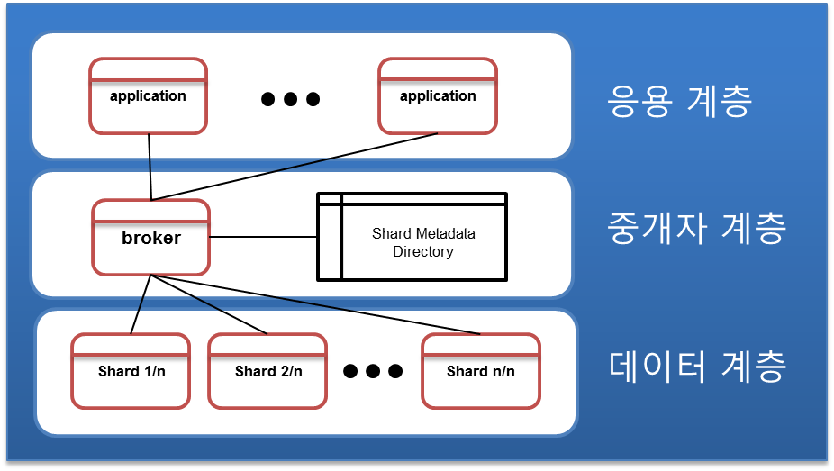
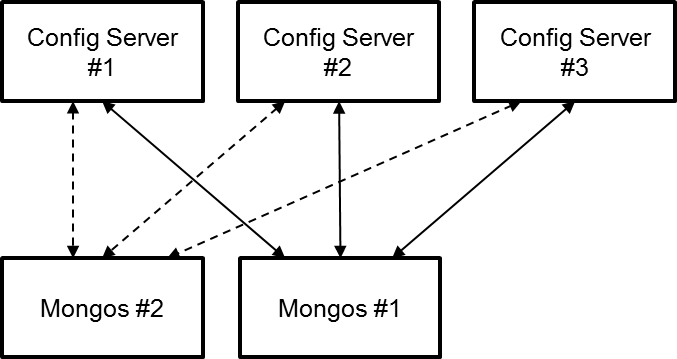
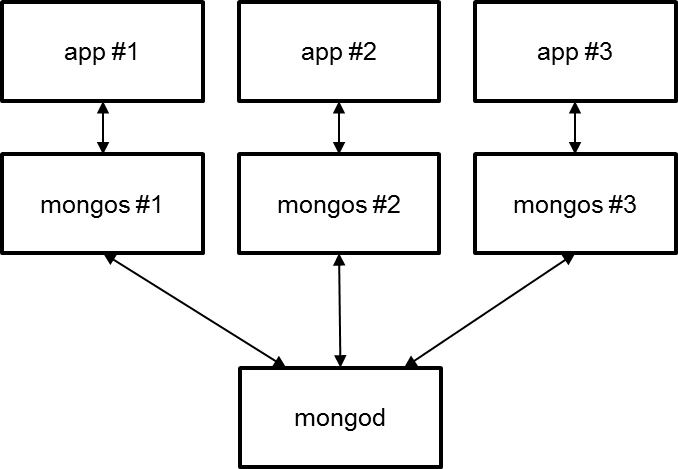
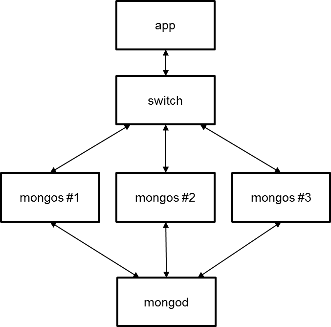
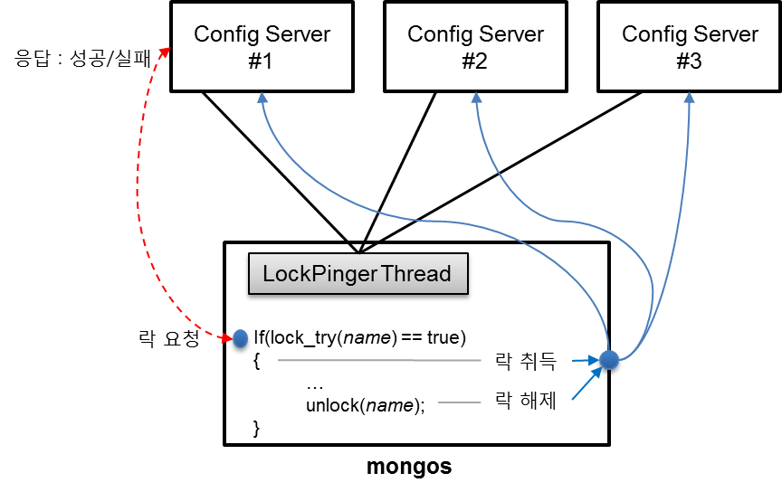
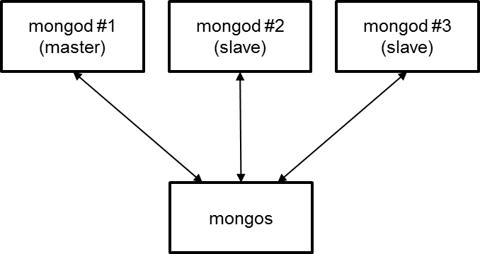
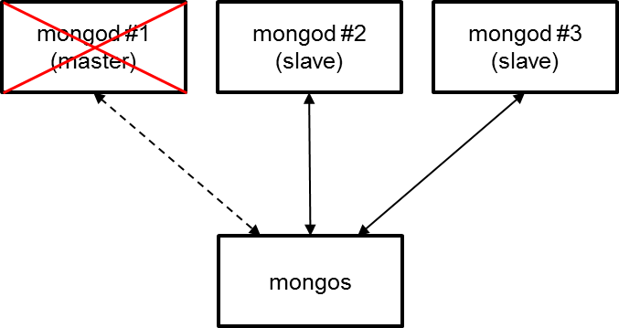

# 몽고디비의 샤딩
MongoDB의 샤딩 구조는 분산데이터베이스의 전통적인 분할 3계층 구조 – 응용, 중개자, 데이터 계층 – 를 가진다. __중개자 역할을 담당하는 mongos(라우터)__ 와 __중개자의 메타 정보를 저장하고 있는  config 서버__, 그리고 __데이터를 저장하는 mongod__ 로 구성된다. 본 절에서는 이러한 MongoDB의 샤딩 구조에 대한 기본적인 개념부터, 각 모듈들이 처리하는 내부 구조에 대해서 알아본다.

## 샤딩 시스템 개요
데이터베이스에 저장하는 데이터의 규모가 대용량이 되면서, 기존에 사용하는 데이터베이스 시스템의 용량의 한계를 맞이하게 된다. 이러한 시점에서 관리자는 시스템 업그레이드를 고려한다. 흔히 말하는 시스템 업그레이드란 장비를 고 사양으로 전환하여 기존 시스템의 처리 용량을 증대시키는 것을 말한다. 이를 Scale-Up이라고 한다.

Scale-Up은 기존 사용하는 장비의 업그레이드이기 때문에, 기존 장비 사양에 따라 증설 계획이 결정된다. 하지만, 일반적으로 데이터베이스 장비는 구매 당시, 시스템 안정성을 고려하여 가장 우수한 성능의 시스템으로 구매한다. 이러한 장비를 다시 고 사양으로 업그레이드한다는 것은 장비 하나를 더 추가하는 것보다 비싼 대가를 치르게 된다.

그렇다면, 비용대비 기존 장비를 어떻게 활용하는 것이 대용량 데이터베이스를 저장하는 방법일까? 이러한 문제점을 해결하기 위해 __데이터베이스 시스템은 소프트웨어적으로 데이터베이스를 분산시켜 처리할 수 있는 구조__ 를 만들었다. 이러한 기술 중 하나가 __샤딩(sharding)__ 이다. 샤딩은 데이터베이스가 저장하고 있는 테이블을 테이블 단위로 분리하는 방법과 테이블 자체를 분할하는 방법으로 나누어진다.

여기서, 우리가 기존에 사용하던 데이터베이스에 총 5개의 테이블이 저장되어 있다고 가정하자. 그리고, 5개의 테이블에 대용량 데이터가 몰려 시스템 사양을 초과하여, 이를 샤딩하기 위해 한 대의 테이터베이스 시스템을 2대로 증설한다고 가정하자. 이와 같을 경우, 전자의 경우인 테이블 단위로 분리하는 방법은 총 5개의 테이블에서 첫 번째 장비에는 테이블 3개, 두 번째 장비에는 테이블 2개로 분리하는 것을 말하고, 후자의 경우인 테이블 자체를 분할하는 방법은 총 5개의 테이블을 모두 반반씩 쪼개어 두 개의 장비에 나누어 저장하는 방법을 말한다. [그림 4-1]의 (a)는 테이블 단위로 분리하는 방법을 (b)는 테이블 자체를 분할하는 방법에 대해서 보여준다.

[그림 4-1]과 같이 한 곳에 저장되어있던 테이블을 두 개 이상의 샤드(shard, 개별적 노드를 샤딩에서는 샤드라고 말한다.)로 테이터를 분리하는 경우, 테이터베이스 시스템은 사용자 질의에 따라 검색되어야 할 데이터가 어느 샤드에 있는지 위치 정보를 관리하는 모듈이 필요하다. 이러한 __샤딩된 데이터의 위치 정보를 관리하는 모듈을 중개자broker라 하며, 질의를 분석하여 샤드를 선택하고, 응답에 대한 결과를 전달하는 역할을 담당한다.__ [그림 4-2]은 샤딩 시스템의 구조를 보여준다.

샤딩 시스템은 [그림 4-2]와 같이 크게 3 계층으로 – 응용계층, 중개자 계층, 데이터(서버 또는 샤드) 계층 – 으로 구성된다. 응용계층은 데이터에 접근하기 위해 중개자를 통해 모든 데이터 입출력을 진행한다. 따라서 응용은 샤딩된 데이터베이스 시스템의 자세한 구조를 알 필요 없이 마치 잘 추상화된 한 개의 데이터베이스가 존재하는 것처럼 응용 계층은 느끼게 된다. 데이터 계층은 여러 개의 샤드(또는 서버)들로 구성되며, 각각의 샤드는 일반 데이터베이스 시스템과 동일한 역할을 담당한다. 가운데 있는 중개자 계층은 샤딩 시스템의 가장 핵심적인 부분으로 샤드 메타 정보(shard meta data)를 저장하여 중개자로부터 전달된 질의를 분석하여 적절한 샤드에 명령을 수행하여 그 결과를 응용에 전달한다.

중개자 계층이 저장하는 샤드 메타 정보는 분할을 결정하는 정책에 따라 다음과 같이 분류된다.

+ 형태에 따른 분류  
형태에 따른 분류는 [그림 4-1]과 같이 테이블 자체가 분할되기 때문에 데이터 유형에 따라 저장될 테이블을 분류하는 방법이다. 이러한 분류 방법은 __테이블이 분할되지 않기 때문에 테이블간 독립성이 보장된 쿼리에서 높은 성능을 보장한다.__ 예를 들어, 저장 매체에 따른 분류로 텍스트, 사운드, 동영상과 같이 테이블을 분류하는 방법 또는 사용자 아이디별로 분류하여 테이블을 분류하는 방법 등이 있다.

+ 키 기반 분류  
__샤딩 시스템에서 가장 많이 사용하는 방법 중 하나로 테이블의 특정 필드를 기준으로 필드 값의 범위에 따라 샤드를 결정하는 방법이다.__ 보통 범위를 결정하는 필드를 샤드 키(shard key)라고 하며, 샤드 키의 분할 범위는 샤드 키의 전체 데이터 개수에 따라 자동으로 설정 또는 사용자가 설정하는 방법으로 나누어진다. 전자와 같이 자동으로 분할 범워를 결정하는 것을 자동 샤딩(auto sharding)이라고 하며, 후자와 같이 사용자가 설정하는 방법을 수동 샤딩(manual sharding)이라고 한다.

+ Look-up 테이블 기반 분류  
키 기반 분류 방법의 단점은 특정 영역으로 데이터 값이 몰릴 경우에 분할되기 전, 특정 샤드에 데이터가 집중되는 문제점을 가진다. 즉 데이터가 특정 샤드에 몰릴 경우에 해당 샤드는 부하가 발생되어 전체 시스템의 성능을 떨어뜨리는 결과를 초래한다. 또한 샤드가 한 쪽 범위에서 발생되기 때문에 잘못된 샤드 키 설정으로 인한 전체 시스템 성능이 개선되지 않는 문제점을 가지고 있다. 이러한 단점을 해결하기 위해 __해쉬 기법을 도입하여 샤드 키 자체를 분할하기 보다 입력된 샤드 키의 해쉬 값을 통한 분할 정책을 사용한다.__ 샤드 키의 해쉬 값은 랜덤 하게 균등 분배되어 특정 샤드 범위에 데이터가 몰리더라도 균등 분배되는 장점이 있다.

위에서 논한 세가지 샤드 전략이 각각 장단점을 모두 내포하기 때문에 어떤 전략을 사용하는가는 프로그래머에 의해 선택된다. 형태에 따른 분류는 독립된 쿼리가 보장되는 시스템에서 RDB를 분할하는 방법에 효과적이고, 키 기반 분류는 자동 샤딩 시스템에 잘 적용된다. 반면, __look-up 테이블은 scale-out 중심의 분산 데이터베이스에 적합한 구조이다.__

## Config 서버
MongoDB의 config 서버는 동일한 역할을 담당하고 있는 __3대로 구성된다.__ 3대로 구성되어 있다면 일반적으로 config 서버 집합은 fail-over를 위한 복제 구조를 사용한다고 판단할 수 있다. 즉, 3대 중 한 대가 master가 되어 master 서버의 데이터를 나머지 두 대의 slave가 데이터를 동기화시키는 구조로 생각된다. 또는 master-master 구조로 어느 서버에 데이터를 저장하든 나머지 두 대가 저장된 데이터를 공유할 수 있다고 생각한다.

하지만, MongoDB의 config 서버는 매우 독특하다. Config 서버 자체는 매우 수동적인 서버로 자기 스스로 데이터를 취득하기 위한 능동적인 역할을 하지 않는다. 그렇다면, 3대의 Config 서버들은 어떻게 데이터를 동기화시키는가? 방법은 간단하다. __Config 서버와 연결되어 있는 mongos를 통해 데이터를 동기화시킨다.__

[그림 4-4]는 mongos와 config 서버와의 연결을 보여준다. 우선 [그림 4-4]에서 mongos가 하나도 설치되지 않았다고 가정하면, config 서버 3개는 단지 서로들 간의 연결 고리가 없는 독립 서버 3대가 존재하는 형태가 된다. Mongos가 설치되면서 mongos가 사용할 config 서버 3대를 등록시키면, mongos는 config 서버와 연결을 시도한다. Config 서버와의 연결은 3대와 동시에 연결되며, 3대 중 한 대라도 연결이 되지 않을 경우는 mongos는 연결 실패로 MongoDB가 기동되지 않는다.

3대의 config 서버와 연결된 mongos는 연결 초기에 config 서버와 최초로 연결된 것을 확인되면 자신의 샤딩 정책을 포함한 메타 정보를 config 서버 3대에 동시에 보낸다.([그림 4-4]는 mongos와 config 서버와의 연결을 보여준다. 우선 [그림 4-4]에서 mongos가 하나도 설치되지 않았다고 가정하면, config 서버 3개는 단지 서로들 간의 연결 고리가 없는 독립 서버 3대가 존재하는 형태가 된다. Mongos가 설치되면서 mongos가 사용할 config 서버 3대를 등록시키면, mongos는 config 서버와 연결을 시도한다. Config 서버와의 연결은 3대와 동시에 연결되며, 3대 중 한 대라도 연결이 되지 않을 경우는 mongos는 연결 실패로 MongoDB가 기동되지 않는다.

3대의 config 서버와 연결된 mongos는 연결 초기에 config 서버와 최초로 연결된 것을 확인되면 자신의 샤딩 정책을 포함한 메타 정보를 config 서버 3대에 동시에 보낸다. 이 부분을 유심히; 살펴볼 필요가 있다. 일반 복제 구조에서는 클라이언트는 master에게만 데이터를 보내고 master에 저장된 데이터를 slave 또는 다른 master 들이 동기화 매커니즘을 통해 데이터를 공유한다. 하지만, MongoDB는 자신이 가지고 있는 복제 매커니즘이 있음에도 불구하고 왜 mongos를 통해 config 서버에 데이터를 저장하는 것일까? 여러 가지 이유가 있을 수 있지만, 분명한 것은 config 서버는 복제 구조를 가지지 않는다는 것이며, 성능상의 이슈로 복제를 사용하지 않는 것으로 보인다.

성능상의 문제에 대해 조금 논의해 보자. 복제는 데이터 양이 많아서 응용이 이를 처리해 주기 힘든 경우에 알아서 데이터 동기화를 시키는 구조에 적합하다. 하지만, config 서버에 저장되는 데이터는 아주 극소수이다. 단지 샤드 메타 정보를 저장하기 위해 복제 구조로 config 서버를 만들 필요성을 느끼지 않은 것인가 판단된다. 또한 config 서버는 fail-over에 의한 master 선출도 없다. 복제 구조로 구성된 config 서버가 아니기 때문에 이는 당연하지만, mongos 입장에서는 config 서버의 중요성 때문에, 한 대라도 죽으면 정상적이지 않다고 판단한다.

이와 같이 mongos에서는 config 서버와의 통신을 매우 중요하게 생각한다. 따라서 mongos는 config와의 데이터 연산 중에서 쓰기 연산을 일관성이 강한 연산으로 처리한다. Mongos는 config 서버와 쓰기 연산을 config 서버에 확실하게 저장되어 있는지 응답을 확인하는 SAFE 모드로 동작한다.

그럼 ‘Mongos가 한대만 존재하는가?’라는 질문을 우리는 생각할 수 있다. MongoDB의 샤드 구조는 mongos 개수를 제한하지 않는다. [그림 4-4]에서 mongos #2가 새롭게 첨가된다고 가정하자. 우선, Mongos #2를 기동하기 위해서는 mongos #1과 동일하게 3대의 config 서버 정보를 넘겨주어야 한다. 이때 Mongos #2는 config 서버에 샤딩 메타 정보가 있는지 확인한다. 샤딩 정보를 확인한 mongos #2는 config 서버의 샤딩 정보를 읽어 들여 자신의 메모리에 데이터를 저장하고, mongos #1과 동일한 데이터를 공유한다. 그리고, mongos #1과 #2는 서로 연결하지 않고, config 서버를 통해 데이터를 공유한다.) 이 부분을 유심히 살펴볼 필요가 있다. 일반 복제 구조에서는 클라이언트는 master에게만 데이터를 보내고 master에 저장된 데이터를 slave 또는 다른 master 들이 동기화 매커니즘을 통해 데이터를 공유한다. 하지만, MongoDB는 자신이 가지고 있는 복제 매커니즘이 있음에도 불구하고 왜 mongos를 통해 config 서버에 데이터를 저장하는 것일까? 여러 가지 이유가 있을 수 있지만, 분명한 것은 config 서버는 복제 구조를 가지지 않는다는 것이며, 성능상의 이슈로 복제를 사용하지 않는 것으로 보인다.

성능상의 문제에 대해 조금 논의해 보자. 복제는 데이터 양이 많아서 응용이 이를 처리해 주기 힘든 경우에 알아서 데이터 동기화를 시키는 구조에 적합하다. 하지만, config 서버에 저장되는 데이터는 아주 극소수이다. 단지 샤드 메타 정보를 저장하기 위해 복제 구조로 config 서버를 만들 필요성을 느끼지 않은 것인가 판단된다. 또한 config 서버는 fail-over에 의한 master 선출도 없다. 복제 구조로 구성된 config 서버가 아니기 때문에 이는 당연하지만, mongos 입장에서는 config 서버의 중요성 때문에, 한 대라도 죽으면 정상적이지 않다고 판단한다.

이와 같이 mongos에서는 config 서버와의 통신을 매우 중요하게 생각한다. 따라서 mongos는 config와의 데이터 연산 중에서 쓰기 연산을 일관성이 강한 연산으로 처리한다. Mongos는 config 서버와 쓰기 연산을 config 서버에 확실하게 저장되어 있는지 응답을 확인하는 SAFE 모드로 동작한다.

그럼 ‘Mongos가 한대만 존재하는가?’라는 질문을 우리는 생각할 수 있다. MongoDB의 샤드 구조는 mongos 개수를 제한하지 않는다. [그림 4-4]에서 mongos #2가 새롭게 첨가된다고 가정하자. 우선, Mongos #2를 기동하기 위해서는 mongos #1과 동일하게 3대의 config 서버 정보를 넘겨주어야 한다. 이때 Mongos #2는 config 서버에 샤딩 메타 정보가 있는지 확인한다. 샤딩 정보를 확인한 mongos #2는 config 서버의 샤딩 정보를 읽어 들여 자신의 메모리에 데이터를 저장하고, mongos #1과 동일한 데이터를 공유한다. 그리고, mongos #1과 #2는 서로 연결하지 않고, config 서버를 통해 데이터를 공유한다.

다음은 config 서버에 저장되는 정보를 요약한 것이다.
+ 샤드 메타 정보
+ 분산 락
+ 복제 집합 정보

첫 번째 샤드 메타 정보는 mongos가 처리하는 청크(chunk) 단위의 샤딩 정보를 저장하고, 분산 락은 mongos들간의 전체 시스템 락을 의미한다. 이 부분에 대해서는 ‘MongoDB의 분산 락’ 절에서 자세히 다루도록 한다. 그리고 마지막으로 복제 집합 정보를 config 서버가 저장하는데, 이는 [그림 4-4]와 같이 새로운 mongos가 동일한 config 서버에 연결될 때, 자신이 관리하여야 할 또는 접속하여야 할 mongod 샤드 정보를 획득할 때, 해당 정보를 같이 얻을 수 있다.

## 라우터 - mongos
앞 절에서 살펴본 것과 같이, 중개자 역할을 담당하고 있는 mongos를 MongoDB에서는 라우터라고 말하고 있다. Mongos는 MongoDB의 샤딩 구조에서 가장 핵심이 되는 모듈이다. Mongod는 복제를 담당하고, mongos는 샤딩을 담당한다. 이와 같이 MongoDB는 역할에 따른 모듈을 분리함으로써 시스템에 몰리는 부하를 분산시킬 수 있는 구조로 개발되었다. 다음은 mongos가 수행하는 일들을 정리한 것이다.

+ Config 서버로부터 상태를 모니터링 하며, 샤딩 메타 정보를 취득하거나 변경된 부분을 저장한다.
+ 데이터 계층의 mongod의 데이터 크기를 계산하여 적절한 시기에 분할을 수행한다.
+ 데이터 계층의 복제 집합으로 구성된 한 샤드의 서버들을 모니터링 하여, master의 변경 정보를 취득한다.
+ 응용 계층의 질의를 분석하여 적절한 샤드에 질의를 수행한다.

### 라우터와 Config 서버
앞 절에서 논의한 바와 같이 mongos와 config 서버 간의 통신은 __mongos가 처리할 기본적인 데이터를 config 서버에 저장하는 구조이다. Mongos에 데이터를 저장하지 않는 것은, mongos 간의 연결이 없기 때문에, 나중에 첨가되는 mongos에 데이터 동기화 매커니즘을 위해 config 서버를 사용한다.__

mongos는 기본 10초 주기로 config 서버에 두 개의 질의를 수행한다. 첫 번째 질의는 mongos의 현 상태를 업데이트하는 것이고, 두 번째 질의는 분산 락에 대한 상태를 업데이트하는 것이다. Mongos에서 처리하는 분산 락은 balancer라는 명칭으로 mongos들 간의 데이터 공유를 수행 한다. 만약, 첫 번째 질의는 mongos가 샤딩을 수행한 상태라면 10초 주기에서 5초 주기로 config 서버와의 통신 주기를 짧게 가져간다.

### 라우터와 mongod
mongos는 샤드를 관리하기 위한 쓰레드 `ReplicaSetMonitorWatcher`와 `WriteBackListener`를 사용한다.  
`WriteBackListener` 쓰레드는 mongos에 샤드가 설정될 때, 샤드에 등록된 mongod 리스트를 취득하여 각각의 mongod와 연결을 유지시킨다.  
`ReplicaSetMonitorWatcher` 쓰레드는 10초 주기로 mongos가 관리하고 있는 mongod 서버에 복제 정보를 요청하여 데이터를 취득한다. 복제 정보에는 복제 집합 정보(이름과 노드 리스트)와 master 여부와 master 서버 주소, 그리고 mongod에 저장된 BSON 객체 크기를 알려준다.  

[그림 4-5]는 두 개의 mongos와 3개의 mongod로 구성되어진 모습이다. [그림 4-5]를 보면 mongos는 서로 다른 mongos와의 통신 연결선이 없는 대신에 모든 mongod 서버와 연결선을 가지고 있다. 즉, mongod 서버에 문제가 발생하면 mongos는 자기 스스로 문제점을 찾아 해결 방안을 강구하게 된다.
쓰레드 WriteBackListener는 최초 연결된 mongod와의 소켓 연결을 유지하여, mongod의 소켓이 close될 때, 이벤트를 발생시켜 mongod가 문제가 있음을 인지하고, config 서버로부터 변경된 샤드 정보가 있는지 요청한다. 획득한 config 서버의 정보를 이용하여 mongod 서버와 10초 주기로 재 접속을 시도한다. 그리고, 주기적인 복제 정보를 취득하는 쓰레드 ReplicaSetMonitorWatcher 역시 mongod의 상태를 체크하여 master 정보를 획득하고, master 정보가 획득되면 변경된 master로 연산을 수행한다. 자세히 살펴보면, 쓰레드 `WriteBackListener`의 역할은 한 샤드의 복제 정보가 변경되었을 경우에 샤드 정보를 업데이트하는 용도로 사용되고, 한 샤드를 구성하고 있는 복제 집합 노드의 fail 처리는 `ReplicaSetMonitorWatcher`에서 수행한다.

한가지 재미있는 사항은 mongos는 mongod의 문제점을 바로 인지할 수 있으나, 문제에 따른 master 취득과정이 실시간이 아니라는 것이다. 이러한 사항은 mongod의 복제 구조를 생각해 보면 쉽게 알 수 있다. Mongod의 복제 구조는 master가 fail이 되면 master를 선출하기 위해 투표를 수행한다. 이러한 투표 과정 시간이 약 10초, 길게는 30초~1분 정도 소요될 수 있기 때문에 mongos 입장에서는 master가 선출될 때까지 기다려야 한다. 운이 좋게도 master가 아닌 slave가 fail이라면 mongos 입장에서는 기존 master로 계속 연산을 수행한다.

### 라우터와 응용프로그램
응용은 직접 mongod로 데이터를 전송하는 것이 아니라, MongoDB의 라우터를 통해 데이터를 mongod에 저장한다. 따라서, 샤딩 구조에서의 MongoDB는 응용의 데이터 저장 구조를 3단계(tier)로 가지고 간다.

[그림 4-6]은 3단계로 구성된 mongos를 이용한 응용에서의 MongoDB를 사용하는 구조를 보여준다. 응용에서는 `sendToMongos()`라는 함수를 이용하여 mongos에 데이터를 전송한다. Mongos는 응용으로부터 전달 받은 데이터를 읽어 들여, 유효한 샤드를 검색하여 해당 샤드의 master로 `sendTomongod()` 함수를 통해 수행된다. 여기서 `sendToMongos()`와 `sendToMongod()` 함수의 차이점은 `sendToMongos()`는 mongos로부터 응답을 기다리고 있는 block mode 통신이고, `sendToMongod()`는 1장에서 살펴본 것과 같이 mongod의 소켓 버퍼에 데이터가 전달되었다는 것만 확인하고 리턴하는 함수이다. 즉, 응용과 mongos와의 통신은 일관성 SAFE와 유사하고, mongos와 mongod의 통신은 일관성 NORMAL과 동일하다.

한가지 주의할 점은 응용과 mongos의 통신이 일관성 SAFE와 유사하다고 해서, SAFE 모드로 동작한다는 것은 아니다. 여기서 유사라는 것은 SAFE 모드와 같이 저 수준의 소켓 라이브러리의 ACK가 아닌, 상대편의 응답을 기다리는 블록 모드라는 것이 동일한 개념이라는 것이다. 만약, 응용의 `sendToMongos()`가 일관성 SAFE 모드로 동작한다면, [그림 4-7]과 같이 동작한다.

MongoDB의 일관성 모드 SAFE는 데이터 저장소에 저장되었다는 것을 의미하므로, [그림 4-6]의 서버에 데이터가 도착하였다는 것보다, 데이터 저장 처리를 더 수행하여 mongod가 보내준 완료 메시지를 mongos가 받을 때까지 블록 모드로 대기한다. 샤딩 모드와 독립 모드에서의 MongoDB의 성능을 고려해 보자. 독립 모드에서의 NORMAL은 [그림 1-4](./images/pic1201.png)와 같은 구조로 동작되고, 샤딩 모드에서는 [그림 4-6]과 같이 동작한다. 그림의 차이에서 보듯이 샤딩 모드에서는 중간에 mongos가 동작하고, mongos와 응용은 블록 모드로 동작하는 시간이 독립 모드보다 더 첨가되었다. SAFE 일관성은 독립 모드에서의 동작은 [그림 1-5](./images/pic1202.png)와 같고, 샤딩 모드에서는 [그림 4-7]과 같다. 따라서, __샤딩 모드가 독립 모드보다 느리며, 실 성능 평가에서도 샤딩 모드가 3배 정도 느리게 나타난다.__

그렇다면, 왜 샤딩 모드로 MongoDB를 사용한다면 성능은 포기하여야 하는가? 하는 의문점이 생긴다. 앞에서 논한 3배 정도의 속도 저하는 독립 모드와 1:1:1로 구성된 한 개의 샤드 모드의 성능 평가에 따른 것이다. 속도가 느려지는 이유는 mongos의 데이터 처리 과정이 단순 데이터 전송이 아니라, 샤드를 선택하는 일련의 과정이 필요하기 때문이다. Mongos는 응용에서 전달된 샤드 키의 범위에 따라 특정 샤드를 선택하고, 데이터 균등 분배를 위한 밸런스 역할을 담당하는 mongos의 기능이 있다. 따라서, 샤딩 모드에서의 mongod의 성능은 독립 모드와 동일하다. 그렇다면 mongos와 mongod가 1:1의 관계를 가지지 않는다면, mongod의 성능을 최대로 구현할 수 있을 것이다. __그렇다. MongoDB는 mongos와 mongod의 비율을 꼭 1:1로 가져가지 않는다. Mongos와 응용과 mongod를 연결시켜주는 라우터로, 한 개의 mongod에 2개 이상의 mongos를 사용할 수 있다.__ [그림 4-8]은 mongod와 mongos의 관계를 1:n으로 구성한 예를 보여준다.

샤딩 모드가 독립 모드보다 약 3배 정도 느리기 때문에 [그림 4-8]과 같이 구성시킬 경우는 독립 모드에 준하는 성능까지 향상시킬 수 있다. 하지만, [그림 4-8]과 같이 구성할 이유는 전혀 없다. 이는 독립 모드로 구성시킨다면 응용을 포함하여 2대면 될 것을 구태여 4대 또는 7대로 구성할 필요가 없기 때문이다. [그림 4-8]에서 조금 더 나아가 보자. Mongos와 응용의 관계는 1:1로 유지되어야 하는가? 하는 의문도 생긴다. MongoDB는 응용이 mongos와의 개별적인 연결을 수행하기 때문에 꼭 1:1의 관계를 가질 필요는 없다. [그림 4-8]에서 응용을 3대가 아닌 1대로 [그림 4-9]와 같이 구성한다고 가정하자.[그림 4-9]의 응용의 성능 이슈가 있을 수 있지만, 샤딩 모드에서 부하는 mongos에서 이루어진다. 따라서, 응용의 성능에 따라 [그림 4-8]과 [그림 4-9]는 동일한 성능이 나타난다. 하지만, [그림 4-9]의 문제점이 없는 것은 아니다. 이 역시 이와 같이 사용할 경우는 __응용이 연결하고자 하는 mongos를 관리하고 있어야 하며, 특정 mongos가 fail 되었는지를 항상 모니터링하고 있어야 한다.__

  

[그림 4-10]은 [그림 4-9]의 __mongos의 상태를 모니터링하는 문제점을 해결하기 위해 스위치에 가상 IP를 만들어 부하 분산을 시키고 있다.__ 이와 같을 경우, 응용은 가상 IP를 통해 한 개의 mongos만 연결을 시도한다. 만약 mongos #1이 fail 되었다면, 스위치는 자동으로 인식하여 해당 서버로 데이터를 보내지 않을 것이다. 또한 응용은 자신이 보낸 연산이 에러가 발생하였다면, 가상 IP로 재 연산을 시도하면 새로운 mongos로 연결되어 연산 처리를 계속 수행한다.상기와 같이 샤딩 구조에서 응용, mongos와 mongod와의 관계는 여러 가지 존재한다. 서비스를 구성할 때, 질의가 많은 시스템이라면, [그림 4-9]과 적합할 것이고, 쓰기 만을 수행하는 구조라면 경제성 있는 [그림 4-10]과 같이 적은 수의 응용으로 최적화 시킬 수 있을 것이다. 모든 분산 시스템과 마찬가지로 MongoDB 역시 모듈 별 구성 방법은 QC(품질 관리)를 통한 시스템 성격에 맞추어 가장 최적의 상태를 찾아 설계하는 것이 바람직하다.

## 분산 락
MongoDB의 분산 락 역시 일반 락과 동일하게, __mongos가 사용하게 되는 자원의 독점을 위해 분산 락을 사용한다.__ Mongos가 독점하는 자원은 다음과 같다.

+ 밸런서(balancer)의 연산
+ 컬렉션(collection)의 분할(split)
+ 컬렉션의 이관(migration)

상기의 내용을 보면 공유자원이기 보다는 연산 쪽에 가깝다. 맞다. Mongos는 mongos의 핵심 기능인 샤딩을 수행할 연산들에 대해 분산 락을 사용한다. 즉, 여러 개의 mongos가 설치되어 있다면, 설치된 mongos 중에 상기의 작업을 아무나 먼저 시작할 수 있고, 시작된 연산에 대해 독점하고 있음을 다른 mongos에 알려주어야 한다. 독점 여부를 알려주는 방법이 분산 락이다. [그림 4-11]은 mongos와 config 서버와의 분산 락 구조를 보여준다.

LockPinger 쓰레드의 중요한 역할은 30초 주기로 ping 타임을 갱신하는 것이다. 이 ping 타임은 분산 락 지속시간과 관련 있다. 예를 들어, 분산 락 지속시간이 일정 시간을 초과하였지만, ping 타임이 30초 주기로 계속 갱신을 하고 있다면, 시스템 부하가 발생한 것이 아니라, 분락 락을 이용한 연산이 오래 걸린다고 판단할 수 있다. 반대로, 분산 락 지속시간과 ping 타임이 동일하게 변하기 않고 있다면, 분산 락을 소유한 노드에 문제가 발생한 것으로 판단할 수 있다.

그럼, mongos가 분산 락을 어떻게 처리하는 지 흐름을 파악해 보자. [그림 4-11]과 같이 MongoDB는 분산 락을 특정 이름으로 구성한다. Mongos가 사용하는 분산 락의 이름은 balancer라는 고정된 분산 락과 컬렉션 명으로 구성된 분산 락 이름이 사용된다. Mongos에서 특정 이름의 분산 락을 확보하기 위해 lock_try()라는 함수를 호출한다. 함수 `lock_try()`는 primary(Mongos를 기동시킬 때, 지정된 첫 번째 config 서버가 primary 서버가 된다.)로 설정된 첫 번째 config 서버에 해당 이름의 락이 설정되어 있는지 요청한다. 왜 첫 번째 config 서버에서만 락 정보를 얻어오는가? MongoDB는 SyncCluster라는 개념의 연결 풀connection pool을 사용한다. SyncCluster는 n개의 서버와 동시에 연결되어 있으며, 쓰기 연산에 대해서는 n개의 서버에 동시에 데이터를 전달하고, 읽기 연산에 대해서는 n개 중 한 개의 응답만 전달되면 값을 리턴해 준다. Config 서버는 3대 모두 항상 죽어서는 안 되는 구조이기 때문에 읽기 연산인 분산 락 정보를 취득하는 것은 첫 번째 서버에서만 얻어오게 된다.

mongos는 취득한 분산 락 정보에 대한 결과를 분석한다. 우선, 락 정보가 존재하지 않다면, 다른 mongos에서도 한번도 획득한 적이 없는 최초의 분산 락이므로, 락 정보를 생성하고 분산 락을 취득했음을 config 서버에 통보한다. Config 서버로부터 받아온 분산 락 정보가 있다면, mongos는 분산 락 상태 플래그를 조사한다. 분산 락 상태 플래그는 0 값을 가질 경우, unlock 되었다는 것을 의미하고, 0이 아닌 값은 누군가에 의해 해당 분산 락이 lock 되었음을 의미한다. 해당 분산 락의 취득 시간과 ping 타임을 비교하여 15분을 초과하였을 경우는 분산 락을 취득한 시스템에 문제가 발생하였다고 판단하고 락을 강제로 해제하고 새로운 소유자가 소유되었음을 통보한다. 분산 락의 활용이 완료되었다면, mongos는 `unlock()` 함수를 통해 해당 분산 락의 상태 플래그를 0으로 변환하고, 분산 락이 해제되었음을 config 서버에 통보한다.

이 부분에서 우리는 한가지 의문점이 생긴다. 즉, 두 개의 mongos에서 동시에 동일한 분산 락을 획득하기 위해 시도할 경우에는 어떻게 될 것인가? 다행스럽게도 MongoDB는 앞 절에서 살펴보았듯이 쓰기 연산은 락이 전역적으로 한 개만 존재하며, mongos는 config 서버와의 쓰기 모드를 SAFE로 처리하기 때문에 쓰기에 관한 트랜젝션(transaction)은 보호된다. 다만, [그림 4-11]에서 락을 취득하기 위해서는 락 요청과 락 취득 이라는 2단계 작업이 수행되는데, 락 요청과 취득 사이에 다른 mongos에서 분산 락을 취득할 수 있다. 이러한 문제를 위해 mongos는 분산 락 취득 후, 다시 분산 락 정보는 요청하여 소유자가 자신과 동일한지 판단하고, 동일하다면 성공 아니면 실패로 간주한다.

## 샤딩의 한계

+ 한 청크에 저장될 수 있는 BSON 객체의 개수는 250,000개이다.
+ 한 청크에 설정할 수 있는 분할 지점의 최대 개수는 8,192개이다.
+ MongoDB로 설정할 수 있는 샤드 노드의 개수는 1,000개가 목표이다. 하지만, 10gen에서도 테스트된 샤드의 개수를 100개 정도로 한정하고 있다.

## 데이터 유실 가능성
앞 장에서도 이 문제에 대해서도 언급하였지만, 샤딩 구조에서의 데이터 유실 가능성에 대해서도 논의할 필요가 있다. 샤딩 구조가 아닌 복제 구조에서는 master가 fail되고 난 뒤 선출하게 되는 약 10초 동안의 데이터가 유실될 수 있다고 하였다. 이러한 문제는 샤딩 구조에서도 동일하게 발견된다. 샤딩 구조가 아닌 시스템에서는 mongos와 같은 라우터가 존재하지 않기 때문에 응용은 항상 master만을 바라보게 된다. 따라서, master의 fail을 바로 알게 되고, 프로그래머는 master fail에 대한 대처를 직접 작성하여야 한다.

문제는 샤딩 구조에서 여러 가지 문제점들을 보일 수 있다. [그림 4-12]와 같이 3개의 mongod와 1개의 mongos가 연결되었다고 가정하자. 그림과 같이 mongod #1이 master로 설정되어 있다. 정상적으로 잘 동작하고 있던 MongoDB에 부하가 발생하고 있고, 원인을 알 수 없는 문제로 인해 master 서버가 fail 되었다. [그림 4-13]과 같이 mongos는 쓰레드 `ReplicaSetMonitorWatcher`가 수행되기 전까지 아직도 mongod #1을 master로 간주한다. 이 때 응용으로부터 전달된 질의를 수행하면 master와의 연결이 끊어진 경우이기 때문에 mongos는 에러를 발생한다.

일정 시간이 지나, 쓰레드 `ReplicaSetMonitorWatcher`이 mongod #1이 fail된 것을 인식하고, 복제 정보를 갱신한다. [그림 4-14]과 같이 MongoDB는 투표를 통해 mongod #2를 master로 선출하였고, mongos 역시 mongod #2를 master로 인식하여 정상적인 작업을 수행하게 된다.

이 시점을 가만히 고려해 보자. [그림 4-9]에서 정상적으로 입력된 데이터가 아직 복제를 성공하지 못하고, master가 fail이 되었다면, 새롭게 선출된 master에 있는 oplog 데이터로 새로운 복제를 수행하게 될 것이다. 이와 같을 경우 mongos는 mongod #1에 삽입하였던 데이터가 사라졌다는 것을 인식할 수 없게 된다. 앞 장에서 살펴보았던 10초의 룰이 적용되었기 때문에, __master 선출에서 최악의 경우 10초의 데이터가 사라질 수 있다.__

또한, mongos는 master 선출에 관여할 수 없기 때문에 master가 없다면, slave가 읽기 연산 모드를 지원해 주지 않는다면, MongoDB 자체는 전체 다운이 되어 버린다. 예를 들어, [그림 4-9]의 환경에서 mongod #1이 먼저 fail되지 않는다면, mongod #1이 master 자격을 유지하고 있기 때문에 나머지 두 대의 slave가 fail이 되어도 1대의 master로 시스템은 유지된다. 하지만, [그림 4-11]과 같이 새로운 master가 선출되고 난 다음에, 새롭게 선출된 master인 mongod #2가 fail된다면, salve인 mongod #3는 투표를 수행할 수 없게 된다. 따라서, slave만 존재하는 상태가 되어, 정상적인 MongoDB 수행이 어려워진다.
